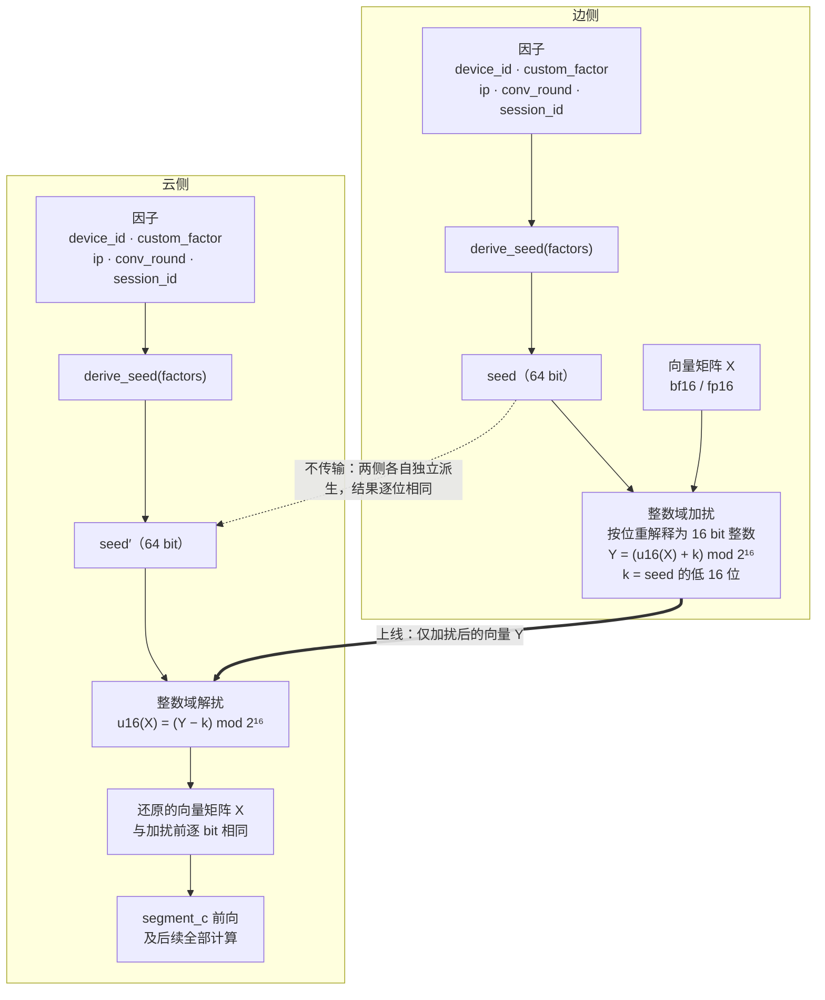
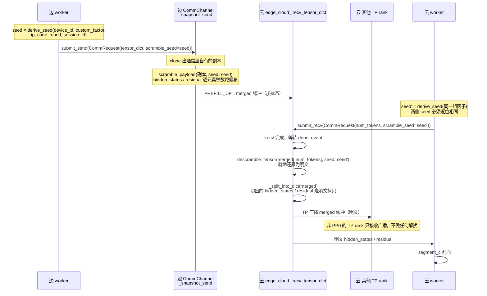
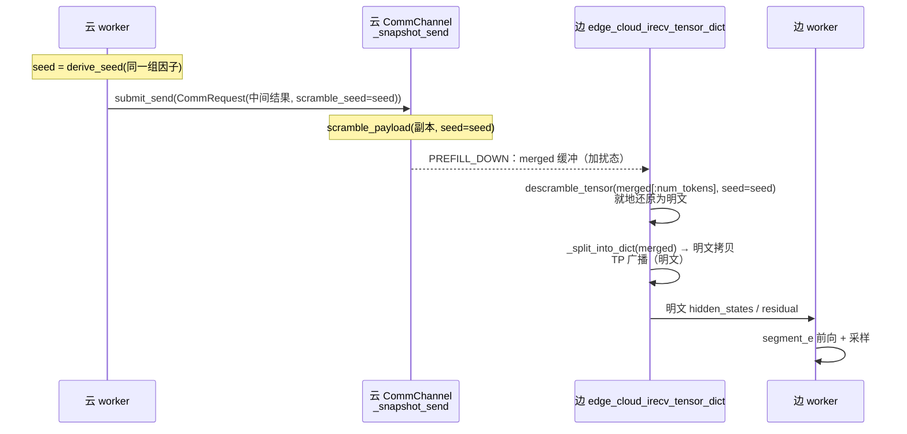

# 加扰与解扰

> 独立模块：**接收向量与各因子，做加扰 / 解扰**。不依赖 vLLM、边云、通信层、调度器的任何代码。

| 项 | 内容 |
|---|---|
| 模块 | `vllm_ascend/distributed/edge_cloud_comm/payload_scramble.py`（**单文件**，~200 行，叶子依赖） |
| 对外 | `derive_seed` / `key_check` / `conformance_digest` / `scramble_tensor` / `descramble_tensor` / `scramble_payload` / `descramble_payload` |
| 输入 | 一个向量矩阵（或张量字典）+ 各因子 |
| 输出 | 就地加扰 / 就地还原（返回实际处理的键，便于调用方断言） |
| 不负责 | 因子从哪来、怎么在两侧同步、在何处调用、何时开闭 |
| **位置与调用方** | 见 **§8**（目录位置、2 个调用点、0 个新增调用链、端到端流程） |

---

## 原理图



**四条要点**（图里每一步的理由）：

| # | 要点 | 为什么这样设计 |
|---|---|---|
| 1 | 两侧**各有一份因子**，各自跑 `derive_seed` | seed **不上线**；只要因子相同，派生结果就逐位相同 |
| 2 | 变换在**整数域**做（把 16 bit 浮点按位重解释为整数再加偏移） | 浮点域加法在 bf16/fp16 下**不可逆**（量化示例见 §2 中"为什么没有 `fadd`"一段）；整数域偏移在 `Z/2¹⁶` 上成群，逆元唯一 → **严格无损** |
| 3 | 上线的东西**只有加扰后的向量 Y** | seed、key 本体都不在线上（线上只有因子与校验摘要，见 §2.6） |
| 4 | 云侧**先还原再做 segment_c** | 下游 attention / MoE 看到的张量与不加扰时逐 bit 相同，因此开启加扰不影响输出 |

> 本方案是**传输态混淆 / 防误读**，不是密码学加密：因子在控制面明文传输，掌握因子与派生规则者可复算 seed。定位与边界见 §8.8。

---

## 1. 模块边界

| | 属于模块 | 属于调用方 |
|---|---|---|
| 因子取值 | 只做**规范化**（去端口、IPv6 压缩、缺失降级） | 从哪拿：`device_id`、`custom_factor`、`ip`、`conv_round`、`session_id` 全部由调用方传入 |
| seed | **派生**（`BLAKE2b`，两侧同因子 ⇒ 同 seed） | 保证两侧传入**相同**的因子 |
| 加扰 / 解扰 | **算子实现**（整数域、严格无损、就地） | 决定对哪些张量、在何处调用、何时调用 |
| 一致性 | 提供 `key_check()` 摘要供两侧比对 | 实际做握手与失败处理 |
| 开关 | **无开关**（见 §5） | 自行决定是否调用；该开关是**全局的**（两个传输方向同开同关，不做逐方向控制） |

模块内**不含**：配置读取、环境变量、单例、调度器 / 控制面交互、网络传输、vLLM import。

---

## 2. API

```python
# vllm_ascend/distributed/edge_cloud_comm/payload_scramble.py

def derive_seed(
    *, device_id: str, custom_factor: str, ip: str | None, conv_round: int | None,
    session_id: str,
) -> int:
    """由因子派生 64 bit seed。因子相同 ⇒ seed 逐位相同（两侧各自调用即可对齐）。"""

def key_check(*, device_id, custom_factor, ip, conv_round, session_id) -> int:
    """seed 的 16 bit 摘要。运行期逐批一致性校验用（不泄露 seed）。"""

def conformance_digest(*, device_id: str, custom_factor: str) -> int:
    """启动一致性校验用：以固定哨兵因子跑完整派生，返回 32 bit 摘要。

    两侧相等 ⇒ 静态因子、规范化规则、因子顺序、模块版本都一致。不涉及传输。
    """

def scramble_tensor(t, *, factors: Mapping | None = None, seed: int | None = None,
                    op: str = "iadd") -> "torch.Tensor":
    """就地加扰**一个**张量（一个向量矩阵），返回入参本身。factors 与 seed 二选一。"""

def descramble_tensor(t, *, factors=None, seed=None, op="iadd") -> "torch.Tensor":
    """scramble_tensor 的严格逆。参数必须与对应的调用完全一致。"""

def scramble_payload(d: Mapping[str, "torch.Tensor"], *, factors=None, seed=None,
                     op="iadd", skip: Iterable[str] = ()) -> list[str]:
    """对张量字典逐项调用 scramble_tensor；返回**实际处理**的键列表。

    不在 skip 中的张量若 dtype 不是 16 bit 浮点 → 抛 ValueError（必须显式排除）。
    """

def descramble_payload(d, *, factors=None, seed=None, op="iadd",
                       skip=()) -> list[str]:
    """同上，逆操作。"""
```

**两组函数的分工（一张表说清）**

| | `*_tensor` | `*_payload` |
|---|---|---|
| 输入 | **单个**张量（向量矩阵） | **张量字典** `{key: tensor}` |
| 覆盖范围 | 你给的那个，不筛选 | 遍历字典，逐项处理；`skip=` 里的键显式排除 |
| 遇到不支持的 dtype | 抛 `ValueError` | 不在 `skip` 中 → 抛 `ValueError`（**不静默跳过**） |
| 返回 | 入参本身（便于链式） | **实际处理的键列表**（便于断言 / 日志） |
| 实现 | 算子本体 | `scramble_tensor` 的**薄封装**（遍历 + 收集键名） |
| 实际用在哪 | 接收侧 **merge 路径**：缓冲是单个 merged tensor（§8.2 ②） | 发送侧 `tensor_dict`、接收侧非 merge 路径（§8.2 ①②） |

两者都需要，不是冗余：发送侧的载荷天然是字典（`hidden_states` + `residual`），而 merge 路径接收侧拿到的是**一个** `cat` 后的缓冲（`:1246`），没有键可分。

**输入校验（fail fast，绝不静默跳过）**

| 校验 | 行为 |
|---|---|
| dtype 为 `bfloat16` / `float16` | 否则抛 `ValueError`，错误信息带上实际 dtype 与张量名 |
| 张量可按 16 bit 重解释 | `.view(torch.int16)` 失败时抛 `ValueError`，提示先 `.contiguous()` |
| `factors` 与 `seed` 恰好给一个 | 都不给或都给 → `ValueError` |
| `op` ∈ `{iadd, xor}` | 否则 `ValueError` |

> `*_payload` 返回实际处理的键，是为了让调用方能对「我以为都处理了」做断言；但**它不会因为遇到不支持的张量就悄悄少处理一个**——那种情况一律抛错，必须由调用方用 `skip=` 明确表达"这个键有意不处理"（例如 `skip={"mrope_positions"}`：int64 的位置索引是结构信息，不该被加扰）。

**为什么没有 `fadd`（浮点域加法）**

需求字面是"每个数加上 seed"，但浮点域加法在 bf16/fp16 下**不可逆**，无法满足需求第 2 条"云侧还原出**原来的**向量矩阵"：

- bf16 有效精度 8 bit（相对精度 `2⁻⁸ ≈ 0.39%`）；`y = round_bf16(x + s)` 的误差上界是 `ulp(y)/2`。
- `|s| ≫ |x|` 时 `ulp(y) ≈ ulp(s)`，回减 `x' = round_bf16(y − s)` 落在以 `ulp(s)` 为步长的网格上，**一般 `x' ≠ x`**。

示例（hidden 量级 `|x| ~ O(1)`，`ulp(1) = 2⁻⁷ ≈ 0.0078`）：

| `s` | `ulp(s)` | 往返误差 | 相对误差 |
|---|---|---|---|
| 8 | 0.0625 | ±0.031 | ~3% |
| 1024 | 8 | ±4 | ~400%（彻底破坏） |

所以浮点加法不是"有损选项"，而是**不满足需求**，故不提供（避免被误用）。整数域偏移在语义上同样是"每个数加上 seed"，且逐位可逆。

---

## 3. 因子与 seed

### 3.1 因子

| 因子 | 类型 | 传入方 | 规范化（模块内做） |
|---|---|---|---|
| `device_id` | `str` | 调用方 | UTF-8 原样（不做大小写折叠） |
| `custom_factor` | `str` | 调用方 | UTF-8 原样 |
| `ip` | `str \| None` | 调用方 | 去端口（`a.b.c.d:port` / `[x::y]:port`）→ IPv6 压缩 + 小写 → 去前导零；非法 / `None` → 降级 `"0.0.0.0"` |
| `conv_round` | `int \| None` | 调用方 | 十进制无前导零；越界 / `None` → 降级 `-1` |
| `session_id` | **`str`（必填）** | 调用方 | 去除首尾空白（`strip()`）；其余原样 |

**降级必须两侧一致**：`ip` 无效时统一取 `"0.0.0.0"`、`conv_round` 缺失时统一取 `-1`。若一侧降级、另一侧报错，就是 seed 错配（静默垃圾）。模块只提供**确定性**的降级规则，不因缺失抛错——是否允许缺失由调用方决定。

**`session_id` 为必填（无默认值）**，理由是它属于"漏传就会让 seed 静默退化"的那类因子：给默认值 `""` 会让调用方少传一个参数时**不报错**、只是把会话维度从 seed 里丢掉。设为必填后，漏传在开发期就是 `TypeError`。确实没有会话概念的场景（如单轮 completion）显式传 `""` 即可——空串是合法的"无会话作用域"取值，不是错误，模块不对此抛错；若部署要求必须非空，由调用方自行校验。

> 原先这里是一个可选参数 `context`（用途/轮次域分离）。改为 `session_id` 后它成为**实质因子**而非辅助域；若将来仍需要额外的域分离，改 `_KDF_DOMAIN` 的版本串即可（那会让两侧 `key_check` 显式不匹配，而不是无声错配）。

### 3.2 派生

```python
_KDF_DOMAIN = b"vllm-ascend/payload-scramble/v1"
_US = b"\x1f"          # 分隔符：避免因子内容含歧义

def derive_seed(*, device_id, custom_factor, ip, conv_round, session_id):
    h = hashlib.blake2b(digest_size=8, person=b"ec-scr01")
    h.update(_KDF_DOMAIN)
    for part in (device_id, custom_factor,
                 canonical_ip(ip), str(canonical_round(conv_round)),
                 session_id.strip() if session_id else ""):
        h.update(_US); h.update(part.encode("utf-8"))
    return int.from_bytes(h.digest(), "big")      # 64 bit

def key_check(*, device_id, custom_factor, ip, conv_round, session_id):
    seed = derive_seed(device_id=device_id, custom_factor=custom_factor,
                       ip=ip, conv_round=conv_round, session_id=session_id)
    return int.from_bytes(hashlib.blake2b(
        seed.to_bytes(8, "big"), digest_size=2, person=b"ec-chk01").digest(), "big")
```

**因子顺序固定**为 `device_id → custom_factor → ip → conv_round → session_id`，各段以 `\x1f` 分隔（避免因子内容含分隔歧义）。**新增或重排因子一律视为破坏性变更**：两侧必须同步升级，否则 `key_check` 会立即不匹配（这是设计意图，不是缺陷）。

**必须用 `hashlib`，禁止内置 `hash()`**：CPython 对 `str` 的 `hash()` 受 `PYTHONHASHSEED` 逐进程随机化（SipHash 加盐），两侧进程必然得到不同值 → 功能失效且**表现为静默错误**。同理禁用 `id()` / `time.time()`。

`blake2b(person=...)` 与 `_KDF_DOMAIN` 提供域分离与版本域：换算法时改 domain，两侧 `key_check` 会**显式不匹配**，而不是无声错配。

### 3.3 启动一致性校验

**为什么需要**：静态因子错配会让**每一次** flight 都错，而错配的表现是"输出垃圾且不报错"。运行期的逐批 `key_check` 虽然最终也能发现，但那要等到**第一个用户请求**到达——应该在服务启动时就失败。

**启动时能校验什么、不能校验什么**：

| 因子 | 启动时可校验 | 说明 |
|---|---|---|
| `device_id` / `custom_factor`（静态） | ✅ 全量覆盖 | 启动时已确定，不一致则每次 flight 都错 |
| `ip` / `conv_round` / `session_id`（动态） | ❌ | 启动时无请求；只能靠运行期逐批 `key_check` |
| **派生规则 / 因子顺序 / 模块版本** | ✅ | 两侧版本不一致时（例如云侧不认识新增字段）会静默按明文处理 |

**做法**：不要只比对静态因子的原始字符串——要用一组**固定哨兵动态因子**跑一遍完整派生，再比对摘要。这样校验的是"整条派生链路一致"，而不只是"配置一样"：

```python
_PROBES = (
    ("192.0.2.1", 1, "probe"),            # 常规 IPv4（192.0.2.0/24 为文档用段，不会撞真实地址）
    ("[2001:db8::1]:8080", 2, "probe"),   # 去端口 + IPv6 压缩
    (None, 3, "probe"),                   # ip 缺失 → 降级 "0.0.0.0"
    ("192.0.2.1", None, "probe"),         # conv_round 缺失 → 降级 -1
)

def conformance_digest(*, device_id: str, custom_factor: str) -> int:
    """启动一致性校验用：以固定哨兵因子跑完整派生，返回 32 bit 摘要。

    两侧 digest 相等 ⇒ 静态因子、规范化规则、因子顺序、模块版本四者都一致。
    不涉及任何传输；交换由调用方完成。
    """
    h = hashlib.blake2b(digest_size=4, person=b"ec-cfrm1")
    for ip, rnd, sid in _PROBES:
        h.update(derive_seed(device_id=device_id, custom_factor=custom_factor,
                            ip=ip, conv_round=rnd, session_id=sid).to_bytes(8, "big"))
    return int.from_bytes(h.digest(), "big")
```

**位宽的选择**：启动校验用 **32 bit**（碰撞 `2.3e-10`），运行期逐批校验仍用 **16 bit** `key_check`。理由：启动校验是"一次性、覆盖整个生命周期的结论"，一旦误判为"相同"就是永久静默垃圾，`2⁻¹⁶ ≈ 1.5e-5` 的碰撞率换不来那 2 字节的节省；而逐批校验每批都跑，且有等长载荷作为事实上的交叉验证，16 bit 足够。

**校验必须与开关无关地执行**：无论加扰是否启用，都跑一次 `conformance_digest` 交换。这样它还能顺带发现"一侧以为关了、另一侧以为开着"——那种不一致下，关闭侧根本不会去算 `key_check`，运行期机制覆盖不到。两侧交换的内容因此是一个二元组：

```
(enabled: bool, conformance_digest: int)
```

任一不等 → **拒绝启动**（而不是"警告后继续"，因为下游失效是静默的）。

---

## 4. 算子

### 4.1 整数域偏移

把 16 bit 浮点按位解释为整数，加上 seed 低 16 位（模 `2¹⁶`）：

| op | 语义 | 可逆性 | 额外内存 | 核数 |
|---|---|---|---|---|
| `iadd`（默认） | `u16(x) + (seed & 0xFFFF) mod 2¹⁶` | **严格无损** | 0 | 1 |
| `xor` | `u16(x) ^ (seed & 0xFFFF)` | **严格无损**，位混合更强 | 0 | 1 |

实现要点：

- 零拷贝位视角：`t.view(torch.int16)`（reinterpret，不复制、不分配）。
- `iadd` 以有符号形式表达模偏移：`signed_k = k if k <= 0x7FFF else k - 0x10000`；逆变换用 `(-k) & 0xFFFF` 再同样转换。
- **平台回绕语义必须开机自证**：C++ 有符号溢出属 UB、PyTorch 未文档化。首次调用时用向量化探针验一次（微秒级），结论缓存：

```python
def _check_wraparound() -> bool:
    import torch                                     # 延迟导入
    probe = torch.arange(65536, dtype=torch.int32).to(torch.int16)
    for k in (0x0001, 0x7FFF, 0x8000, 0xFFFF):
        if not torch.equal((probe + _signed(k)) - _signed(k), probe):
            return False
    return True
```

失败时切 `_iadd_exact`（`int32` 中间量 → `& 0xFFFF` → 映射回有符号范围 → 窄化；约 3× 流量 + 2× 临时内存），并 `WARNING` 一次。

### 4.2 无损性

设 `u = u16(x) ∈ Z/2¹⁶`，`k = seed & 0xFFFF`：

- 加扰：`v = (u + k) mod 2¹⁶`
- 解扰：`u' = (v − k) mod 2¹⁶ = u` ∎（`xor` 同理：`(u ⊕ k) ⊕ k = u`）

**逐 bit 还原**，下游 attention / MoE 看到的张量与不加扰时完全相同——这是需求第 2 条"还原出原来的向量矩阵"的充分依据。

### 4.3 覆盖范围由调用方决定

模块按 **dtype** 决定能否处理（16 bit 浮点），**不按 key 名硬编码**：

- `hidden_states` / `residual` 等 bf16/fp16 张量 → 可处理
- `mrope_positions` 等 int64 张量 → 抛错，或由 `skip=` 显式排除（位置索引是结构信息，且与 16 bit 算子不匹配）

多张量（张量字典）一起处理用 `scramble_payload`；单个张量（如 merge 后的缓冲）用 `scramble_tensor`。两者关系与选择见 §2。

### 4.4 与合并缓冲的关系（调用方若把多个张量 `cat` 成单缓冲）

**标量偏移与 `cat` 可交换**：`cat([x_i + k]) == cat([x_i]) + k`。因此：

- 先逐张量加扰再 `cat`，与先 `cat` 再整体加扰，结果**逐位相同**；
- 接收侧对 merged 缓冲整体解扰即可，切分（`narrow`）自然得到明文。

---

## 5. 为什么模块内没有开关

模块**不提供** enable / kill switch 或"no-op 模式"。加扰与解扰必须严格配对，任何"只在单侧生效"的配置最终都走向静默错误：

| 场景 | 结果 |
|---|---|
| 两侧都调用 `scramble_tensor` / `descramble_tensor` | ✅ 正确 |
| 两侧都不调用 | ✅ 正确（等价于功能关闭） |
| 仅发送侧调用 `scramble_tensor` | ❌ 接收侧把加扰数据当明文用 → 垃圾 |
| 仅接收侧调用 `descramble_tensor` | ❌ 明文被再减一次 → 垃圾 |

**所以开关是调用方的成对决策**，不是模块内的一个标志位。模块只提供 `key_check()` 让调用方自行做两侧一致性校验。

**并且这个开关在调用方层面是全局的**：两个传输方向（边→云、云→边）**要么都开、要么都不开**，不做逐方向控制。已确认采用该口径——"一个方向开、另一个关"这种不一致因此**无法被表达**，也就无法发生。落地要求与握手方式见 §8.4。

---

## 6. 使用示例（调用方视角）

> 下面是**模块的最小用法**；在本项目里落到具体文件、具体函数、具体传参见 **§8**。

```python
from vllm_ascend.distributed.edge_cloud_comm import payload_scramble as ps

factors = dict(device_id=DEV_ID, custom_factor=CUSTOM,
               ip=client_ip, conv_round=turn, session_id=sid)

# 发送侧
ps.scramble_payload(send_dict, factors=factors)          # 就地

# 接收侧（另一进程 / 另一节点）
ps.descramble_payload(recv_dict, factors=factors)        # 就地

# 启动一致性校验（进程启动时一次；不含动态因子，故启动时也可执行）
mine = ps.conformance_digest(device_id=DEV_ID, custom_factor=CUSTOM)
assert mine == peer_conformance_digest, "两侧静态因子/派生规则/版本不一致，拒绝启动"

# 运行期一致性校验（每个 flight 一次；两侧各自的 workers 算出后比对）
assert ps.key_check(**factors) == peer_key_check, "两侧动态因子不一致，本批失败"
```

调用方需要自己解决的四件事（模块不参与）：

1. **因子同步**：让两侧拿到相同的 `device_id` / `custom_factor` / `ip` / `conv_round` / `session_id`。
2. **调用位置**：发送前加扰；拿到后立即解扰，且解扰要早于任何下游使用。
3. **成对与顺序**：`descramble_tensor` 必须用与对应 `scramble_tensor` 完全相同的因子 / `op`；同一 payload 不可重复加扰。
4. **两次一致性校验**：启动时换 `conformance_digest`（覆盖静态因子 + 派生规则 + 版本），运行期逐 flight 换 `key_check`（覆盖动态因子）。模块只算摘要，不负责交换与失败处理。

---

## 7. 失败模式与测试

| # | 失效形态 | 处理 |
|---|---|---|
| 两侧因子不一致 | 解出"错误的明文"，输出垃圾且**无报错** | 启动换 `conformance_digest`（静态因子/规则/版本）+ 运行期逐 flight 换 `key_check`（动态因子）；模块只算摘要 |
| 单侧开关不一致（一侧加、一侧不解） | 输出垃圾且无报错 | 启动握手的载荷含 `enabled`，**与开关无关地执行**（§3.3） |
| 用了 `hash()` | 同上 | §3.2；UT 用 AST 扫描禁止裸 `hash(` / `random` / `id(` |
| 用浮点加法 | 精度损失、无法还原 | §2 不提供 `fadd`；UT 断言 `scramble → descramble` 逐 bit 相等 |
| 处理了非 16 bit 张量 | 语义破坏 / dtype 不匹配 | §4.3 抛错；`scramble_payload` 返回实际处理列表 |
| 平台不回绕 | `iadd` 往返失败 | §4.1 探针 + `_iadd_exact` 回退 |
| 重复加扰 / 只解一次 | 垃圾 | 调用方契约（§6）；UT 覆盖"加扰两次后需解扰两次" |

**测试清单**（全部可脱离 NPU 与边云环境独立运行——这是纯模块的最大好处）：

1. `derive_seed` 确定性；跨进程（不同 `PYTHONHASHSEED`）一致
2. 任一因子变化 → seed 变化；`session_id` 变化 → seed 变化；`session_id` 首尾空白被 `strip()` 归一
3. `canonical_ip`：v4 带端口 / v6 压缩 / 前导零 / `None` / 非法降级
4. `canonical_round`：正常 / `None` / 负数 / 越界
5. `iadd`、`xor` 穷举 65536 个 bit 模式往返（**平台回绕守卫**）
6. bf16 / fp16，含 NaN / ±Inf / 次正规数；非连续张量应抛错并提示 `.contiguous()`
7. 3D 张量（`hc_mult > 1`）与 2D 张量同样正确
8. `scramble_payload` 的返回值与 `skip=` 行为；遇到 int64 张量时报错
9. `scramble_tensor → descramble_tensor` 逐 bit 相等；两次加扰需两次解扰
10. `scramble_tensor(cat([a,b])) == cat([scramble_tensor(a), scramble_tensor(b)])`（§4.4）
11. **等价性**：`scramble_payload(d, seed=s)` 与 `{k: scramble_tensor(v, seed=s)}` 逐 bit 相同（证明"薄封装"契约），返回的键列表 == `set(d) - set(skip)`
12. 无因子 / 同时给 `factors` 与 `seed` / 非法 `op` → `ValueError`
13. 屏蔽 `torch` 后仍能 import 本模块（`derive_seed` / `key_check` / `conformance_digest` 可脱离 torch 使用）
14. `conformance_digest`：确定性；`device_id` 或 `custom_factor` 改一位 → 变化；**改 `_KDF_DOMAIN` 版本串 → 变化**（这是它作为"模块版本一致性"校验的依据）；4 个哨兵各自单独改动都能引起变化

---

## 8. 在本项目中的位置与调用关系

### 8.1 位置

```
vllm-ascend/vllm_ascend/distributed/
├── edge_cloud_comm/
│   ├── payload_scramble.py      ← 本模块（新增，单文件，叶子依赖）
│   ├── channel.py               ← 调用方 ①（发送侧加扰：scramble_payload）
│   ├── types.py                 ← CommRequest + scramble_seed 字段
│   └── service.py / future.py / mapping.py / __init__.py
├── parallel_state.py            ← 调用方 ②（接收侧解扰：descramble）
└── （其他）…

vllm-ascend/vllm_ascend/worker/
└── worker.py                    ← 提供 seed（derive_seed，只算一个 int）
```

**依赖方向（单向，无环）**：

```
channel.py         ──scramble_payload──▶ payload_scramble
parallel_state.py  ──descramble───────▶ payload_scramble
worker.py          ──derive_seed──────▶ payload_scramble
payload_scramble   ──▶ 只依赖 stdlib + hashlib（torch 延迟导入），不 import 项目内任何代码
```

模块**不 import 项目内任何代码**；项目内 import 它的只有上面 3 个文件。

**为什么放 `edge_cloud_comm/`**（而不是顶层 `vllm_ascend/`）：

1. **只有边云场景使用**。调用方 `channel.py` 同包、`parallel_state.py` 是父包、`worker.py` 的 seed 计算也是边云路径——放顶层会让一个纯边云特性的模块看起来像通用工具，对读者是误导。
2. **顶层是跨切面配置/工具的位置**（`ascend_config.py` / `envs.py` / `utils.py`），本模块是数据面实现细节。
3. **不需要为"将来可能复用"付代价**。顶层方案唯一的理由是可复用性，而那是猜测性的；真到需要复用那天再往上搬只需改 3 处 import。
4. `setup.py` 用 `find_packages`，放哪都无需改打包。

> 命名上仍避免 `transform.py` 这类泛化名：`payload_scramble.py` 明确说明它加扰的是"payload（跨节点载荷）"。

**由这个位置引出的一个实现细节**：`parallel_state.py` 是被全项目最早、最广泛 import 的模块之一，若在它的**模块级**写
`from vllm_ascend.distributed.edge_cloud_comm.payload_scramble import descramble`，就会把 `edge_cloud_comm/__init__.py`（及其 `mapping` / `scheduler_api` / `types`）拉进所有进程的 import 图。虽然已核实该 `__init__` 是 import-light 且**无环**（它用 PEP 562 懒加载把 `future` / `service` 隔离在外），仍建议更保守的写法：

```python
# parallel_state.py :: edge_cloud_irecv_tensor_dict() 内，仅在需要时导入
if scramble_seed is not None:
    from vllm_ascend.distributed.edge_cloud_comm.payload_scramble import (
        descramble_tensor, descramble_payload,
    )
```

函数内导入只在边云接收路径、且确实带 seed 时才付出导入代价，非边云部署的 import 图完全不变。这也与模块自身"torch 延迟导入"的风格一致。

### 8.2 调用方与输入

调用点只有 **2 处**（都在通信层），加 1 处**只算 seed**（在 worker）。

| # | 调用方（文件 : 函数） | 调用 | 输入 | 说明 |
|---|---|---|---|---|
| ① | `edge_cloud_comm/channel.py:94`<br>`CommChannel._snapshot_send()` | `scramble_payload(dict, seed=…)` | `request.tensor_dict`（**通信层已 clone 的字典**）+ `request.scramble_seed: int` | 所有 send 路径的唯一漏斗（`channel.py:301/309/323` 是全仓库唯一调用 wire 发送函数的地方）。已 clone ⇒ 就地加扰零分配、不污染模型张量 |
| ② | `distributed/parallel_state.py:1387`<br>`edge_cloud_irecv_tensor_dict()` | merge 路径：`descramble_tensor(merged[:num_tokens], seed=…)`<br>非 merge 路径：`descramble_payload(dict, seed=…, skip={"mrope_positions"})` | `merged` 接收缓冲 + `request.scramble_seed` | 必须在 `_split_into_dict` 与 TP 广播**之前**（§8.3） |
| ③ | `worker/worker.py`<br>收发点（§8.4 列出） | `derive_seed(...)` → 存入 `CommRequest.scramble_seed` | `device_id` / `custom_factor` / `ip` / `conv_round` / `session_id`（调用方提供） | 每批一次，纯 Python 哈希，微秒级 |

`CommRequest` 需要新增一个字段：

```python
# edge_cloud_comm/types.py :: class CommRequest
scramble_seed: int | None = None    # None = 本 op 不加扰/不解扰
```

只透传一个 **int**，不透传因子字典——因子只在一个地方（worker）变成 seed，通信层不需要理解因子语义。

### 8.3 为什么两处调用都必须在通信层（硬约束，非偏好）

**接收侧**：如果改在 worker 里对 `intermediate_tensors` 解扰（看起来更自然），会有两个必然的静默错误：

- **陷阱 1 —— 取不到缓冲**：`edge_cloud_broadcast_recv()` 在 **submit 时刻**（不是回调执行时刻）就急切执行
  `merged_buf = tensor_dict.pop("__merged_payload__")`（`parallel_state.py:1790`），把 merged 缓冲摘出并捕获进闭包。执行期经 `tensor_dict` 取该缓冲**拿不到东西**。
- **陷阱 2 —— 广播会覆盖 / 外泄**：
  - merge 路径：`broadcast_postprocess` 广播后执行 `tensor_dict.update(_split_merged_buffer_into_dict(merged_buf, ...))`（`:1806`）**又切一次**，会用 merged 缓冲**覆盖**先前切分的结果 → "先切分再解扰"被回滚成加扰态。
  - 非 merge 路径：它直接 `torch.distributed.broadcast(tensor, ...)` **原地广播 `tensor_dict` 里的 irecv 缓冲**（`:1838-1846`）→ 解扰必须早于广播，否则加扰数据被广播到所有 TP rank 且永不还原。

worker 拿到 `intermediate_tensors` 时，TP 广播**已经发生**，时机上不可能满足要求（TP=1 时侥幸可行，TP>1 必然错）。

**发送侧**：`_snapshot_send()` 是唯一漏斗且已完成 clone，放这里一次覆盖全部十余个 `submit_send`；放在各 worker 收发点则要重复十余遍。

**例外**：`warmup_edge_cloud_hidden_channels()`（`parallel_state.py:1005`）用 `pp_group.isend_tensor_dict_on_hidden_channel` 直接发 `zeros(8)` dummy，**绕过 `CommChannel`**；它只是建立 P2P rendezvous，不需要加扰，但要记得它绕过了本模块（别误以为"所有上线载荷都过模块"）。

### 8.4 调用流程

主链路（非 draft）的收发点在 `worker/worker.py`，共 4 处；每次都在 `CommRequest` 上带 `scramble_seed`：

| 角色 | 函数 | 行 | 通信 | 方向 |
|---|---|---|---|---|
| 边 | `_execute_model_edge_head` | `:1329` send | `PREFILL_UP` | e2c |
| 云 | `_execute_model_cloud` | `:1469` recv | `PREFILL_UP` | e2c |
| 云 | `_execute_model_cloud` | `:1522` send | `PREFILL_DOWN` | c2e（可选） |
| 边 | `_execute_model_edge_tail` | `:1371` recv | `PREFILL_DOWN` | c2e（可选） |
| 云 | `start_early_irecv` | `:1050/1071` recv | `PREFILL_UP` | e2c（**提前 post** 的同一次 recv） |

**方向一：边 → 云（加扰 → 解扰）**



**方向二：云 → 边（与方向一同构，受同一个全局开关控制）**



**要点**：`wait_for_comm` 里的四个动作（等 `done_event` → 解扰 → 切分 → TP 广播）必须在同一个回调链里按序发生。这也是解扰必须写在 `parallel_state.py` 内部的原因——它是唯一同时能"等到 irecv 完成"和"赶在切分与广播之前"的位置。

**为什么非 PP0 的 TP rank 不做解扰**

- **跨节点 P2P 只有"参与 PP 的那个 rank"会做**。分支判据是 `is_pp_npu0 = pp_group.world_size > 1`（`:1746`），注意它**不是** `rank_in_group == 0`：非 PP0 的 rank 其 `pp_group.world_size == 1`，而 `edge_cloud_irecv_tensor_dict` 开头就是 `if not torch.distributed.is_initialized() or pp_group.world_size == 1: return {}, [], []`（`:1416`）——这些 rank 根本拿不到跨节点载荷。
- 它们走的是 `edge_cloud_broadcast_recv` 的 else 分支（`:1857` 起）：自己分配 merged 缓冲，从 `tp_group.ranks[0]` 收 TP 广播（`:1897-1902`），再本地切分。
- **广播线上传的已经是明文**：PP0 的解扰**就地**改的是同一个 `merged_buf` 对象——它在 `edge_cloud_irecv_tensor_dict` 里以 `tensor_dict["__merged_payload__"]` 暂存，被 `edge_cloud_broadcast_recv` pop 出来后作为默认参数绑定进 `broadcast_postprocess`（`:1790`），而解扰回调先于它执行。因此广播的源缓冲此刻已是明文。
- 所以非 PP0 的 rank **没有可解扰的东西**。反过来，如果它们也解扰，就是对明文再减一次 seed → 垃圾。**"只在 PP0 解扰一次"是正确性要求，不是性能优化。**

**"是否需要保护方向二"这个决定放在哪（已确认：全局单开关）**

需求只要求保护边→云（边侧加扰、云侧解扰）；云→边回传的 segment_c 输出同等敏感。模块内没有方向开关（§5），所以这个决定唯一的载体是：**发送侧是否给 `CommRequest` 填 `scramble_seed`**。

由此产生一个必须显式解决的缺口：**接收侧只在拿到非 `None` seed 时才解扰，因此它必须知道发送侧做了什么决定**——这是两台机器上的两个独立决定。若两侧理解不一致，结果就是 §5 那张表里的静默垃圾（明文被再减一次，或加扰数据被当明文用）。

**已确认的决定：一个全局开关，两个方向要么都开、要么都不开**，不做逐方向控制。这样"一个方向开、另一个关"这种不一致**从设计上无法表达**，也就无法发生。

落地要求（属于调用方契约）：

| # | 要求 |
|---|---|
| 1 | 开关只有**一个**，同时作用于 4 个收发点（边 `_execute_model_edge_head` / 云 `_execute_model_cloud` recv / 云 `_execute_model_cloud` send / 边 `_execute_model_edge_tail`）。开 = 4 处都填 `scramble_seed`，关 = 4 处都填 `None`。**不允许**只对其中一处生效 |
| 2 | 开关的取值两侧必须相同。**建议与因子走同一条控制面**（由边侧调度器作为唯一权威发布，云侧被动跟随），这样系统内该决定只存在一份；若改为两侧各自配置，则必须靠运维保证一致——而"两侧配置不一致 → 静默垃圾"正是本功能最主要的失效形态 |
| 3 | 启动时做一次一致性握手：两侧交换 `(enabled, conformance_digest)`，**与加扰开关无关地执行**。不仅校验静态因子，还覆盖派生规则与模块版本；任一不等即拒绝启动。具体机制见 §8.6 |

> 被放弃的方案：逐方向标志。它需要一个"本方向是否加扰"的字段并保证两侧对它的理解一致，多一个自由度、多一类失效面，且"只保上行不保下行"在安全语义上收益有限——segment_c 的输出与边→云的载荷同等敏感。

### 8.5 谁提供因子（调用方契约）

模块不传因子、不做同步。两侧要拿到相同因子，调用方需自己解决。**已核实的现成链路**：

| 因子 | 可用通道 |
|---|---|
| `device_id` / `custom_factor` | 部署期共享（配置或挂载文件，两侧同值） |
| `ip` | vLLM 的 `vllm_xargs`（`entrypoints/openai/*/protocol.py`）→ `SamplingParams.extra_args` → `Request`（`vllm/v1/request.py`，范式见同文件 `kv_transfer_params`）。**建议由 API 层从 HTTP 上下文提取**，而非客户端自报 |
| `conv_round` | 同上通道；口径（assistant 轮数 / user 轮数 / 消息总数）必须两侧一致 |
| `session_id` | 同上通道（会话 / 对话标识，`str`），两侧必须一致。**必填因子**，漏传会让 seed 静默丢掉会话维度（§3.1） |
| 动态因子的跨节点同步 | 挂在 `SchedulerOutput` 上（服务边云 PD 分离的调度器已按此模式携带 `comm_seqno` / `head_token`，两侧都能从同一个 SO 复算） |

**两次一致性校验**（模块只算摘要，交换与失败处理属于调用方）：启动时换 `conformance_digest`（覆盖静态因子 / 派生规则 / 版本），运行期逐 flight 换 `key_check`（覆盖动态因子）。错配的后果是"解出错误的明文 + 输出垃圾 + 无报错"，所以两处都必须实现。

### 8.6 启动一致性握手的交换机制

模块只算摘要，交换与失败处理属于调用方。交换的载荷是一个二元组：

```
(enabled: bool, conformance_digest: int)     # 32 bit
```

**时机与通道：搭在 init 期已有的 P2P rendezvous 上**

`warmup_edge_cloud_hidden_channels()`（`parallel_state.py:1005`，由 `:604` 在 parallel_state 初始化时调用）本来就要在两个 PP peer 之间交换 payload——它用 `pp_group.isend_tensor_dict_on_hidden_channel` / `irecv_tensor_dict_on_hidden_channel`，其中包含一次 Gloo metadata exchange；而且它**双向**各 warm 一次（`:1069-1072` 对 `(0, peer)` 与 `(peer, 0)`），因此两侧都能拿到对端的值。把 `ec_conformance` 与 `ec_enabled` 两个非张量条目加进那个 payload 即可，不需要新通道。

需要留意的两点：

| 注意 | 说明 |
|---|---|
| warmup 会跳过 | 拓扑不匹配时它打 warning 直接 `return`（`:1040-1055` 对 `pp_group.world_size` 的两处判断），此时握手不会发生 |
| 配置可达性 | 它当前只接收 `parallel_config`，而 `device_id` / `custom_factor` 在 ascend 配置里——需要扩参或从全局取，是一处调用方改动 |

**兜底：挂在首个 `SchedulerOutput` 上**

边侧调度器把 `(enabled, conformance_digest)` 写进 SO，云侧在首个 batch 比对。代价是失败发生在**第一个用户请求**上，而不是启动时——比没有强，但不如 warmup 方案。建议以 warmup 为主、SO 为兜底。

**失败处理：拒绝启动**（或拒绝启用加扰），**绝不"警告后继续"**。下游失效是静默的、且污染每一次 flight，继续运行只会把配置错误变成数据错误。

### 8.7 改动清单

| 文件 | 改动 |
|---|---|
| `distributed/edge_cloud_comm/payload_scramble.py` | **新增**（模块本体，~200 行） |
| `distributed/edge_cloud_comm/types.py` | `CommRequest` + `scramble_seed: int \| None = None` |
| `distributed/edge_cloud_comm/channel.py` | `_snapshot_send` 调 `scramble_payload`；`_wire_recv` 透传 `scramble_seed` |
| `distributed/parallel_state.py` | `edge_cloud_irecv_tensor_dict` 两条路径调 `descramble`；`edge_cloud_broadcast_recv` / `..._on_hidden_channel` 透传形参 |
| `worker/worker.py` | 4 个主链路收发点（§8.4）算 seed 塞进 `CommRequest`；`start_early_irecv`（`:996`）→ 构造 `CommRequest`（`:1050`）时读出 hint 里的因子/seed |
| `v1/engine/passive_core.py` | `_post_irecv_hints_for_arrivals()` 的两处 `post_irecv_hint({...})`（`:754` / `:772`）加字段 |
| `patch/platform/patch_engine_core.py` | `_post_irecv_hints_for_first_batch()` 的两处 `post_irecv_hint({...})`（`:327` / `:349`）加字段 |
| `worker/edge_cloud/shared_model_edge_worker.py` | 5 个收发点同上（仅该拓扑在用才需要） |

**不改**：`edge_cloud_comm/__init__.py`（子模块直接 import，与本包既有的 `types` / `mapping` 一样不进 `__all__`，保持它 "intentionally minimal" 的公开面）、`setup.py`（`find_packages` 自动收录）。

**关于 early-irecv 的 hint（一处需要修正的认知）**：`edge_cloud_comm/scheduler_api.py::make_recv_hint`（`:81`）与 `recv_request_from_hint`（`:107`）是**已退役的 CHER dispatch-time producer 遗留 schema——全仓库没有调用方**（见该文件 `:12-15` 的说明）。**真正的 live producer 是两个 engine-core 文件**：云侧 `v1/engine/passive_core.py::_post_irecv_hints_for_arrivals()` 与边侧 `patch/platform/patch_engine_core.py::_post_irecv_hints_for_first_batch()`。所以新增字段必须加在这 4 处 `post_irecv_hint({...})`（以及 `make_recv_hint` 以保持 schema 同步，可选）。

> **由此引出一个建议**：这两个 producer 分别在**云侧与边侧的 engine-core（调度器）进程**里。如果让它们填 `scramble_seed`，就得在那两个进程里 import 本模块并调用 `derive_seed`（模块的 torch 延迟导入正是为此留的口子）。更省耦合的替代是**让 hint 只携带原始因子**（`ip` / `conv_round`，两者本就在 SO 上），由 worker 在构造 `CommRequest` 时统一做规范化与派生——这样模块的 import 方保持 §8.1 的 3 个文件，调度器进程完全不碰它。**推荐后者**；若选前者，模块的 torch-free 约束就从"nice to have"升级为**硬要求**。

### 8.8 定位说明

本方案是**传输态混淆 / 防误读**，不是密码学加密。若因子与派生规则对观测者可推断，seed 可被复算。定位需与调用方真实的合规要求对齐。
