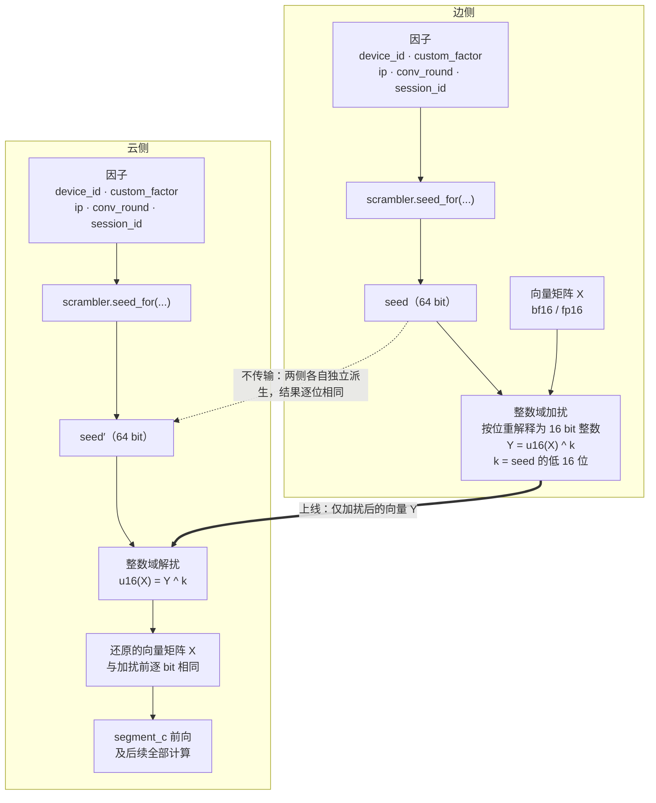
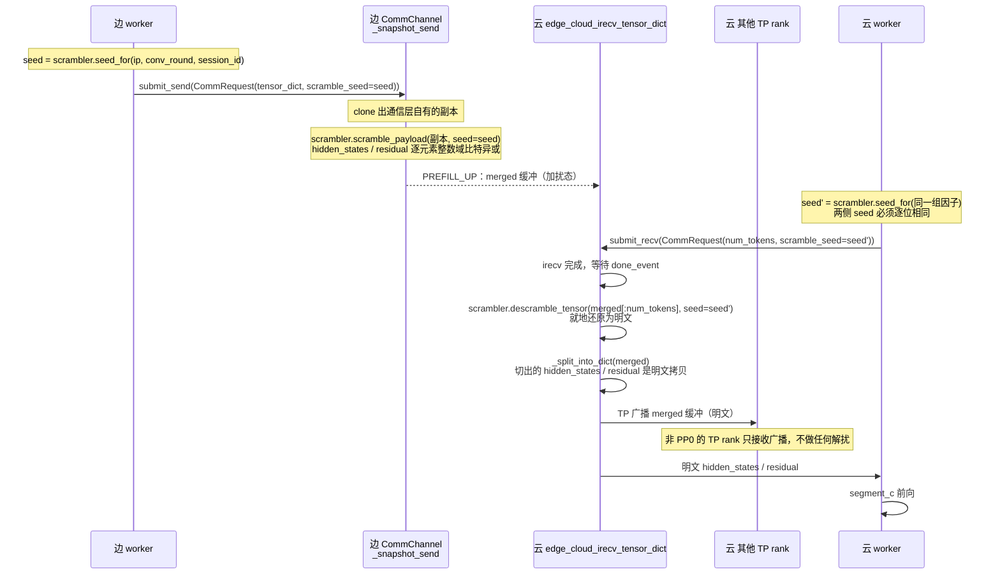
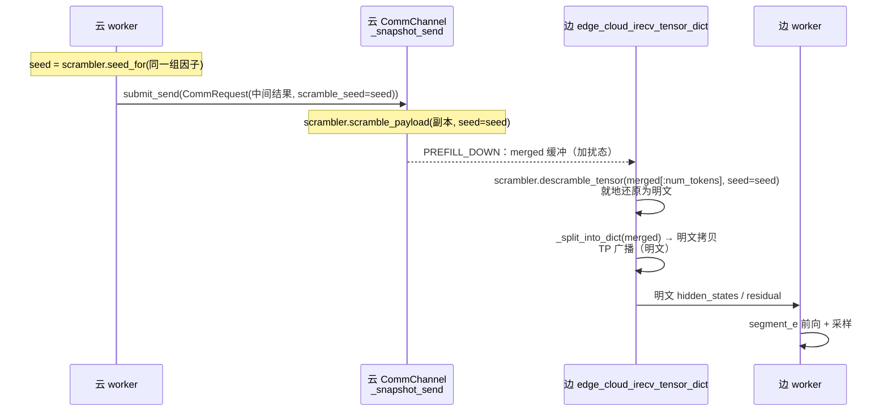

# 加扰与解扰

> 独立模块：**接收向量与各因子，做加扰 / 解扰**。不依赖 vLLM、边云、通信层、调度器的任何代码。

## 介绍

边云协同推理把一套大模型切成三段：边侧跑头部的若干层与尾部的若干层，云侧跑中间层。一次请求因此要在两个节点之间往返若干次，每次往返都要搬运一个矩阵——形状是 `[token 数, hidden 维度]` 的中间激活值，也就是层与层之间传递的那个向量矩阵。

这个矩阵不是统计量、不是索引、也不是元数据，而是**模型中间层的真实激活值**。它经通用网络在两个节点之间走，存在被旁路抓包、被中间设备落盘、被运维手段误采集的可能。加扰与解扰处理的就是这一段暴露，做法很直接：

- 两侧**各自**用同一组因子算出一个相同的 seed；
- 发送前，用这个 seed 把向量矩阵里的**每个数**打乱（按位异或）；
- 接收后用同一个 seed 解回去，**逐 bit 还原**成原矩阵，再交给后续计算。

三件事决定了这个做法为什么可行、以及为什么必须这么写。

**第一，seed 不上线。** 派生所需的因子（设备 ID、企业定制因子、客户端 IP、对话轮次、会话 ID）在两侧都能拿到（静态的来自部署、动态的经控制面同步），双方各自跑同一个派生函数就能得到逐位相同的结果，不需要把 seed 本身发过去。因此"因子怎么同步"与"两侧派生结果是否一致"这两件事，成为落地时最关键的部分——它们不属于本模块，而是调用方的契约。

**第二，变换必须无损。** 最直观的写法是"把 seed 加到每个数上"，但这里有个陷阱：payload 是 bf16 / fp16，浮点加法在这两种精度下**不可逆**——加上一个稍大的 seed 就会抹掉有效低位，再减回来已经回不到原值，而且不会报任何错。所以实际做法是把 16 bit 浮点**按位重解释为整数**，与 seed 的低 16 位**逐位异或**。语义上仍然是"每个数被 seed 打乱"，但严格可逆：接收侧还原出的矩阵与发送前逐 bit 相同，后续 attention / MoE 看到的张量和没开启加扰时完全一样。

**第三，它是一个纯粹的模块。** 因子从哪来、怎么在两侧保持一致、在数据面的哪一步调用、什么时候开启——这些全部留在调用方；模块只做一件事：接收一个向量矩阵和一组因子，做加扰或解扰。因此它不 import 项目里任何代码，可以脱离边云环境单独测试。

需要明确的边界是：**这是传输态混淆，不是密码学加密。** 它挡的是"旁路直接读到明文激活值"与"中间设备落盘"，挡不住能读取控制面并掌握派生规则的攻击者——因子在控制面上是明文传输的，掌握因子与派生规则就能复算 seed。要做成真正意义上的加密，需要预共享密钥配合每次传输的 nonce，那是另一个量级的改动。

| 它是什么 | 它不是什么 |
|---|---|
| 对边云跨节点**中间向量载荷**的逐元素变换 | 不是对权重、KV cache、控制面消息的加密 |
| **严格无损**，开启与关闭时输出逐 bit 相同 | 不是"近似保护、允许精度损失"的方案 |
| 两侧**独立派生**同一个 seed，seed 不上线 | 不是密钥协商或密钥分发机制 |
| 一个**独立模块**：输入向量 + 因子，输出变换结果 | 不是通信层、调度器、某个模型的组成部分 |
| 传输态**混淆**，防旁路明文与误采集 | 不是密码学加密，挡不住掌握因子的攻击者 |

下文先给原理图，再依次说明模块边界、对外接口、因子规范化与 seed 派生、加解扰算子，最后是它在整个项目中的位置与调用关系。

---

| 项 | 内容 |
|---|---|
| 模块 | `vllm_ascend/distributed/edge_cloud_comm/payload_scramble.py`（**单文件**，~550 行含 docstring，叶子依赖） |
| 对外 | **只有一个类**：`PayloadScrambler`（+ 进程级工厂 `get_payload_scrambler`）。类方法：`seed_for` / `seed_digest_for` / `conformance_digest` / `scramble_tensor` / `descramble_tensor` / `scramble_payload` / `descramble_payload` / `from_config` |
| 输入 | 一个向量矩阵（或张量字典）+ 各因子 |
| 输出 | 就地加扰 / 就地还原（返回实际处理的键，便于调用方断言） |
| 不负责 | 因子从哪来、怎么在两侧同步、在何处调用、何时开闭 |
| **位置与调用方** | 见 **§8**（目录位置、调用点与接线点计数、seed 计算时机、端到端流程） |

---

## 原理图



**四条要点**（图里每一步的理由）：

| # | 要点 | 为什么这样设计 |
|---|---|---|
| 1 | 两侧**各有一份因子**，各自跑 `seed_for` | seed **不上线**；只要因子相同，派生结果就逐位相同 |
| 2 | 变换在**整数域**做（把 16 bit 浮点按位重解释为整数，再与 seed 低 16 位**逐位异或**） | 浮点域加法在 bf16/fp16 下**不可逆**（量化示例见 §2 中"为什么没有 `fadd`"一段）；比特异或逐位独立、无进位无溢出，逆元就是自身 → **与平台无关的严格无损**，不需要任何启动自检 |
| 3 | 上线的东西**只有加扰后的向量 Y** | seed、key 本体都不在线上（线上只有因子与校验摘要，见 §2） |
| 4 | 云侧**先还原再做 segment_c** | 下游 attention / MoE 看到的张量与不加扰时逐 bit 相同，因此开启加扰不影响输出 |

> 本方案是**传输态混淆 / 防误读**，不是密码学加密：因子在控制面明文传输，掌握因子与派生规则者可复算 seed。定位与边界见 §8.8。

---

## 1. 模块边界

| | 属于模块 | 属于调用方 |
|---|---|---|
| 因子取值 | 只做**规范化**（去端口、IPv6 压缩、缺失降级） | 从哪拿：`device_id`、`custom_factor`、`ip`、`conv_round`、`session_id` 全部由调用方传入 |
| seed | **派生**（`BLAKE2b`，两侧同因子 ⇒ 同 seed） | 保证两侧传入**相同**的因子 |
| 加扰 / 解扰 | **算子实现**（整数域、严格无损、就地） | 决定对哪些张量、在何处调用、何时调用 |
| 一致性 | 提供 `seed_digest_for()` / `conformance_digest()` 两个摘要方法供两侧比对 | 实际做交换与失败处理 |
| 开关 | **无开关**（见 §5） | 自行决定是否调用；该开关是**全局的**（两个传输方向同开同关，不做逐方向控制） |

模块内**不含**：配置读取、环境变量、单例、调度器 / 控制面交互、网络传输、vLLM import。

---

## 2. API

整个模块只有**一个公开类**和一个进程级工厂。模块级只有私有 helper，分两组：**因子规范化**与 **KDF**——它们都是纯函数，所以放在模块级而不是类里（理由见下）。

```python
# vllm_ascend/distributed/edge_cloud_comm/payload_scramble.py

__all__ = ["PayloadScrambler", "get_payload_scrambler"]

# ---- 模块级私有：因子规范化（纯函数，KDF 也要用）----
def _canonical_str(v: str | None) -> str: ...
def _canonical_ip(v: str | None) -> str: ...
def _canonical_round(v: int | None) -> int: ...

# ---- 模块级私有：KDF 与摘要 ----
def _derive_seed(*, device_id, custom_factor, ip, conv_round, session_id) -> int: ...
def _seed_digest(*, device_id, custom_factor, ip, conv_round, session_id) -> int: ...
def _conformance_digest(*, device_id, custom_factor) -> int: ...


@dataclass(frozen=True, slots=True)
class PayloadScrambler:
    """部署期因子绑定一次，运行期因子每次传。"""

    device_id: str          # 设备对的共享指纹（部署期下发，两侧同值）
    custom_factor: str      # 定制因子（部署期下发，两侧同值）

    # ---- 构造 ----
    def __post_init__(self) -> None: ...          # 规范化 + 非空校验
    @classmethod
    def from_config(cls, cfg) -> "PayloadScrambler": ...

    # ---- 派生（运行期因子是参数，静态因子在实例上）----
    def seed_for(self, *, ip: str | None, conv_round: int | None,
                 session_id: str) -> int: ...
    def seed_digest_for(self, *, ip: str | None, conv_round: int | None,
                        session_id: str) -> int: ...
    def conformance_digest(self) -> int: ...

    # ---- 算子 ----
    def scramble_tensor(self, t: Tensor, *, seed: int) -> Tensor: ...
    def descramble_tensor(self, t: Tensor, *, seed: int) -> Tensor: ...
    def scramble_payload(self, d: Mapping[str, Tensor], *, seed: int) -> list[str]: ...
    def descramble_payload(self, d: Mapping[str, Tensor], *, seed: int) -> list[str]: ...

    # ---- 日志 ----
    def __repr__(self) -> str: ...      # 只报 set/unset，绝不打印因子值


def get_payload_scrambler(*, device_id: str | None = None,
                          custom_factor: str | None = None) -> PayloadScrambler:
    """进程级单例（对标既有的 get_comm_service()）。"""
```

**公开面统计**：`PayloadScrambler` 有 **10 个公开成员**（`from_config` / 3 个派生 / 4 个算子 / 2 个只读字段）+ `__repr__` + `get_payload_scrambler`。

**为什么因子规范化放在模块级，而不是类的 staticmethod**（这里改过一次，记录理由）：KDF（`_derive_seed`）必须做规范化，而它在模块级；若规范化是类的 staticmethod，就会出现"**模块级私有函数调用下面才定义的类**"这种依赖倒置。改成模块级私有后，依赖方向变成单向：**类 → helper**，helper 不依赖任何东西。顺带收敛了公开面（少 3 个 static 方法）。

**为什么删掉了 `static_factors` 属性**：它把"两个静态因子摊平成 dict"暴露成 API，而唯一的消费者 `_derive_seed` 就在本模块内——属于**猜测性通用性**，且会把"部分构造参数"这个内部形状泄露出去。删除后无人受影响（全项目与 UT 都没有调用方）。

**为什么收成一个类，而不是一组模块级函数**（这里改过一次，记录理由）：

| 理由 | 说明 |
|---|---|
| **静态因子只传一次** | `device_id` / `custom_factor` 是部署期确定的，每个调用点重复传没有意义；绑到实例上之后，调用点只写变化的部分 |
| **规范化只做一次** | `strip()` 在 `__post_init__` 里做掉，每 flight 不再重复；顺带让"因子为空"在构造时就报错 |
| **调用点自解释** | `scrambler.seed_for(ip=…, conv_round=…, session_id=…)` 一眼能看出"哪三个是运行期的"，不用对着五参数签名数 |
| **只有一处可看** | 12 个公开函数散在模块级时，读者要自己拼出"这几个是一组"；收进类后 `dir()` 一眼看全 |

**部署期因子 vs 运行期因子**（这是分界线，不能混）：

| | 因子 | 谁提供 | 为什么 |
|---|---|---|---|
| **构造时传入** | `device_id`、`custom_factor` | 部署配置 | 进程内恒定；同进程多个虚拟 worker 拿到的必然相同 |
| **每次调用传入** | `ip`、`conv_round`、`session_id` | 调用方按请求 | `ip` 是**本请求的客户端地址**（由 API 层从 HTTP 上下文提取），`conv_round` 是轮次，`session_id` 是会话 |

> **不要把 `ip` 提到构造参数。** 只有在"单客户端固定 IP"的部署下它才恒定；一般部署下（尤其前面有 nginx 反向代理时）它是**每请求变化**的客户端地址。固定下来会让不同客户端共用同一个 seed——云侧照常解扰、解出错误明文，只能靠逐 flight 的 `seed_digest_for` 事后发现。

**为什么是单例，以及它为什么安全**

| 问题 | 答案 |
|---|---|
| 多个 worker 在**不同进程** | 各自一份实例，互不相干（单例的边界是**进程**） |
| 多个 worker 在**同一进程**（shared-model 边侧，同进程最多 `dp_size` 个虚拟 worker） | 共用同一实例。它们传的因子相同（配置是进程级的），所以不会冲突；真传了不同值 → 直接 `ValueError`，而不是静默取第一个 |
| comm 线程 + 主线程并发读 | 安全。实例 `frozen=True`，构造后**零写入**；seed 路径是五因子的纯函数，重复调用不可能不一致 |
| 首次调用的竞争 | `_PROCESS_SCRAMBLER is None` 判断与赋值没有加锁，极端并发下可能各建一个，但两者内容完全相同（同参数），**结果无差别** |
| 可以让它持有会话级缓存吗 | **不可以**。按 session/flight 建缓存就是设计里明确否决的"跨线程共享状态"（§8.2） |

**`from_config`：唯一知道配置对象形状的地方**

```python
scrambler = PayloadScrambler.from_config(cfg)   # cfg 是 §9.2 的 PayloadScrambleConfig
```

它优先调 `cfg.resolve_custom_factor()`（读挂载文件一次并缓存），没有这个方法时回退到内联的 `cfg.custom_factor`。这样类本身仍然**不读配置、不认识配置类**。

**两处调用点的写法**

```python
# 启动时一次（worker 进程内）
scrambler = get_payload_scrambler(device_id=cfg.device_id,
                                  custom_factor=cfg.resolve_custom_factor())

# 每 flight
seed = scrambler.seed_for(ip=client_ip, conv_round=turn, session_id=sid)
scrambler.scramble_payload(send_dict, seed=seed)      # 就地
```

**两组算子的分工（一张表说清）**

| | `*_tensor` | `*_payload` |
|---|---|---|
| 输入 | **单个**张量（向量矩阵） | **张量字典** `{key: tensor}` |
| 覆盖范围 | 你给的那一个 | 字典中**所有 16 bit 浮点**张量；其余键按 dtype 规则跳过 |
| 遇到不支持的 dtype | **抛 `ValueError`**（你点名传了它，dtype 不对就是错） | 跳过，并在返回值里体现（不报错） |
| 返回 | 入参本身（便于链式） | **实际处理的键列表**（便于断言 / 日志） |
| 实现 | 算子本体 | `scramble_tensor` 的**薄封装**（遍历 + 收集键名） |

**为什么两者的"不支持的 dtype"处理不同**：字典版必须能处理混合载荷（`hidden_states` + `residual` + `mrope_positions`），而对 int64 张量做 16 bit 算子是无意义的——所以它的正确行为是**跳过**。单张量版没有"跳过"这个选项：调用方已经点名要加扰这个张量，dtype 不对就是调用错误，应当立即报错。

**为什么"跳过"不设参数**：跳过的集合**完全由 dtype 决定**，不需要调用方声明。早期版本有一个 `skip={"mrope_positions"}` 参数，它的问题和 `op` 一样——**是一个没有任何校验覆盖的自由度**：若两侧的 `skip` 不一致，被跳过的键是 16 bit 浮点时会出现"一侧加扰、另一侧不加扰"的**静默损坏**（`seed_digest_for` 不含 `skip`）。而 v1 唯一需要跳过的 `mrope_positions` 是 int64，dtype 规则天然推出同样结果。

**调用方如何确认"没有漏处理"**：`返回值` 是实际处理的键，跳过的键 = `set(d) - set(返回值)`。要强断言就写：

```python
processed = scrambler.scramble_payload(d, seed=seed)
assert set(d) - set(processed) == {"mrope_positions"}, "出现了预期之外的未处理键"
```

**签名读法：`*` 与 `seed`**

```python
def scramble_payload(self,
                     d,          # 位置参数：张量字典（单张量版则是张量本身）
                     *,          # 分隔符：它右边的参数只能按关键字传（本身不是参数）
                     seed: int)  # 必填：算好的 seed
```

| 符号 | 是什么 | 为什么这么设计 |
|---|---|---|
| `*` | Python 的**关键字-only 分隔符**，不是参数。它右边的参数不能用位置传（`scrambler.scramble_payload(d, 12345)` → `TypeError`） | ① 防顺序写错——位置传参时把别的参数当成 seed，就是"用错的 seed 解扰"，属于本设计最怕的静默错误；② 调用点自解释（`seed=seed` 比裸整数清楚）；③ **`seed_for(**factors)` 能工作的前提**——字典展开只产生关键字参数，所以三个运行期因子必须关键字-only |
| `seed` | 必填、只能按关键字传 | 算子只做"向量 + seed → 向量"这一步；"因子 → seed"由 `seed_for` 单独完成 |

**算子只接受 `seed`：不提供 `factors`、`op`、`skip`**

三个曾经存在过的参数都已被删除，理由是同一个——**它们都是"没有任何校验覆盖的自由度"**：

| 曾有的参数 | 为什么删 |
|---|---|
| `factors={...}` | ① 两件事本该分开：`seed_for`（因子 → seed）与 `scramble_tensor`（向量 + seed → 向量）是独立两步，算子收 `factors` 等于把派生藏进内部，调用点上看不出"这批用的是哪个 seed"；② **生产路径零调用者**——通信层只从 `CommRequest.scramble_seed` 拿到一个 int，既没有 `SchedulerOutput` 也没有因子；③ 连带少两条校验规则（`factors`/`seed` 二选一、键集合校验） |
| `op="iadd"｜"xor"` | `op` 不参与 `seed_for`，所以 `seed_digest_for` / `conformance_digest` **都覆盖不到它**：一侧按加法加扰、另一侧按异或解扰 → 数据损坏，而两道校验全部通过。v1 固定**异或**（§9.4） |
| `skip={"mrope_positions"}` | 跳过的集合**完全由 dtype 决定**，不需要调用方声明。若两侧 `skip` 不一致，且被跳过的键恰好是 16 bit 浮点，就会出现"一侧加扰、另一侧不加扰"的**静默损坏**（`seed_digest_for` 不含 `skip`）。改为按 dtype 规则跳过（见上表） |

派生因此显式写在调用点上，而不是藏进算子：

```python
seed = scrambler.seed_for(ip=client_ip, conv_round=turn, session_id=sid)
scrambler.scramble_payload(send_dict, seed=seed)      # 就地
```

这一行换来的是**数据流在调用点上可见**——本设计反复强调"seed 必须两侧一致、每 flight 一个"，把派生写出来比藏进算子更贴合这一点。求值次数不是问题：`seed_for` 是纯方法，每个载入点各算一次、结果必然相同（完整时机表见 §8.2）。

**输入校验（fail fast）**

| 校验 | 行为 |
|---|---|
| 构造期：`device_id` / `custom_factor` 非空 | `strip()` 后为空 → `ValueError`（构造时就报，不等第一个请求） |
| `seed` 必须是 `int` | `None` / 其他类型 / `bool` → `ValueError`（否则会在 `seed & 0xFFFF` 处抛出不直观的 `TypeError`；`bool` 会让 `True` 静默等于 `k=1`） |
| 单张量版：dtype 为 `bfloat16` / `float16` | 否则抛 `ValueError`，错误信息带上实际 dtype |
| 张量可按 16 bit 重解释 | 非连续张量 → `ValueError`，提示先 `.contiguous()` |
| 字典版：非 16 bit 浮点的键 | **跳过**（不报错），跳过的键 = `set(d) - set(返回值)` |

> 两类"不支持的 dtype"处理不同，是有意的：字典版必须能处理混合载荷，而对 int64 做 16 bit 算子无意义，跳过是正确行为；单张量版调用方已点名该张量，dtype 不对就是调用错误。

**为什么没有 `fadd`（浮点域加法）**

需求字面是"每个数加上 seed"，但浮点域加法在 bf16/fp16 下**不可逆**，无法满足需求第 2 条"云侧还原出**原来的**向量矩阵"：

- bf16 有效精度 8 bit（相对精度 `2⁻⁸ ≈ 0.39%`）；`y = round_bf16(x + s)` 的误差上界是 `ulp(y)/2`。
- `|s| ≫ |x|` 时 `ulp(y) ≈ ulp(s)`，回减 `x' = round_bf16(y − s)` 落在以 `ulp(s)` 为步长的网格上，**一般 `x' ≠ x`**。

示例（hidden 量级 `|x| ~ O(1)`，`ulp(1) = 2⁻⁷ ≈ 0.0078`）：

| `s` | `ulp(s)` | 往返误差 | 相对误差 |
|---|---|---|---|
| 8 | 0.0625 | ±0.031 | ~3% |
| 1024 | 8 | ±4 | ~400%（彻底破坏） |

所以浮点加法不是"有损选项"，而是**不满足需求**，故不提供（避免被误用）。整数域比特异或在语义上同样是"每个数被 seed 打乱"，且逐位可逆。

---

## 3. 因子与 seed

### 3.1 因子

| 因子 | 类型 | 传入方 | 规范化（模块内做） |
|---|---|---|---|
| `device_id` | `str` | 调用方 | 去除首尾空白（`strip()`）；其余原样，不做大小写折叠 |
| `custom_factor` | `str` | 调用方 | 去除首尾空白（`strip()`）；其余原样 |
| `ip` | `str \| None` | 调用方 | 去端口（`a.b.c.d:port` / `[x::y]:port`）→ IPv6 压缩 + 小写 → 去前导零；非法 / `None` → 降级 `"0.0.0.0"` |
| `conv_round` | `int \| None` | 调用方 | 十进制无前导零；越界 / `None` → 降级 `-1` |
| `session_id` | **`str`（必填）** | 调用方 | 去除首尾空白（`strip()`）；其余原样 |

**所有字符串因子统一 `strip()`**，是因为静态因子通常从**配置文件或挂载文件**读入，而文件内容的"边缘差异"极易造成两侧不一致：

| 差异 | 不 strip 的后果 |
|---|---|
| 尾随换行（`echo x > f` 就会产生） | 两侧字节不同 → seed 不同 → **静默垃圾** |
| CRLF vs LF | 同上 |
| 文件带 BOM | 同上 |
| 首尾多余空格 | 同上 |

两侧都做同样 `strip()` 仍然是确定性的，所以这类运维错误可以**从设计上消掉**，不必依赖"两次人工填写完全相同"。注意：`strip()` 只解决边缘空白，**因子内容本身仍必须逐字节相同**——这条由启动校验兜底（§3.3）。

**降级必须两侧一致**：`ip` 无效时统一取 `"0.0.0.0"`、`conv_round` 缺失时统一取 `-1`。若一侧降级、另一侧报错，就是 seed 错配（静默垃圾）。模块只提供**确定性**的降级规则，不因缺失抛错——是否允许缺失由调用方决定。

**`session_id` 为必填（无默认值）**，理由是它属于"漏传就会让 seed 静默退化"的那类因子：给默认值 `""` 会让调用方少传一个参数时**不报错**、只是把会话维度从 seed 里丢掉。设为必填后，漏传在开发期就是 `TypeError`。确实没有会话概念的场景（如单轮 completion）显式传 `""` 即可——空串是合法的"无会话作用域"取值，不是错误，模块不对此抛错；若部署要求必须非空，由调用方自行校验。

> 原先这里是一个可选参数 `context`（用途/轮次域分离）。改为 `session_id` 后它成为**实质因子**而非辅助域；若将来仍需要额外的域分离，改 `_KDF_DOMAIN` 的版本串即可（那会让两侧摘要显式不匹配，而不是无声错配）。

### 3.2 派生

```python
_KDF_DOMAIN = b"vllm-ascend/payload-scramble/v1"
_US = b"\x1f"          # 分隔符：避免因子内容含歧义

def _derive_seed(*, device_id, custom_factor, ip, conv_round, session_id):
    h = hashlib.blake2b(digest_size=8, person=b"ec-scr01")
    h.update(_KDF_DOMAIN)
    for part in (_canonical_str(device_id),
                 _canonical_str(custom_factor),
                 _canonical_ip(ip),
                 str(_canonical_round(conv_round)),
                 _canonical_str(session_id)):
        h.update(_US); h.update(part.encode("utf-8"))
    return int.from_bytes(h.digest(), "big")      # 64 bit

def _seed_digest(*, device_id, custom_factor, ip, conv_round, session_id):
    seed = _derive_seed(device_id=device_id, custom_factor=custom_factor,
                        ip=ip, conv_round=conv_round, session_id=session_id)
    return int.from_bytes(hashlib.blake2b(
        seed.to_bytes(8, "big"), digest_size=4, person=b"ec-chk01").digest(), "big")
```

> 这两个是**模块级私有函数**（下划线开头），不是 API。公开入口是
> `PayloadScrambler.seed_for()` / `.seed_digest_for()`——它们只负责把实例上的
> 静态因子与调用传入的运行期因子拼起来再转调上面两个。
>
> 三个规范化函数是**模块级私有函数**（`_canonical_ip(...)`），不是类的方法——理由是依赖方向（见 §2）：KDF 在模块级要用它们。它们只被本模块调用，外部拿不到。

**因子顺序固定**为 `device_id → custom_factor → ip → conv_round → session_id`，各段以 `\x1f` 分隔（避免因子内容含分隔歧义）。**新增或重排因子一律视为破坏性变更**：两侧必须同步升级，否则摘要会立即不匹配（这是设计意图，不是缺陷）。

**必须用 `hashlib`，禁止内置 `hash()`**：CPython 对 `str` 的 `hash()` 受 `PYTHONHASHSEED` 逐进程随机化（SipHash 加盐），两侧进程必然得到不同值 → 功能失效且**表现为静默错误**。同理禁用 `id()` / `time.time()`。

`blake2b(person=...)` 与 `_KDF_DOMAIN` 提供域分离与版本域：换算法时改 domain，两侧摘要会**显式不匹配**，而不是无声错配。

**要解决的问题**：两侧各自算 seed。万一算出来不一样，云侧就会用**错的 seed** 去减——减出来的不是原矩阵，是垃圾；垃圾直接喂给中间层，最后输出乱码，而**全程不报错**。你只会看到"模型输出不对"，根本不知道是加扰引起的。

> **先澄清一个容易误读的点**："两侧独立生成 seed" 的准确含义是**同一个 KDF 在两侧各跑一遍**，不是"两侧各自去采集因子"。因子本身是同步的：**边侧从请求里拿，写进控制面；云侧从控制面读**（见 §8.5）。因此 seed 相同是**构造上成立**的——同一函数 + 同一输入。两次校验要防的不是"两个独立随机源撞车"，而是**这个构造前提被破坏**：
>
> | 破坏形式 | 由谁覆盖 |
> |---|---|
> | 两侧派生不一致（版本 / 因子顺序 / 规范化实现不同） | 启动时的 `conformance_digest` |
> | 云侧**读因子那条代码路径**出错（字段名不一致 → 读不到 → 走默认值） | 运行期的 `seed_digest_for`（启动校验用固定哨兵因子，**绕过了控制面解析这条路径**，结构上覆盖不到） |
> | 边侧写出去的值与它自己算 seed 时用的值不一致 | 同上 |

最直接的发现办法是"把 seed 发过去比一下"。但 seed 不上线，所以退一步：只发一个**指纹**（由 seed 算出的 4 字节短摘要）——能比对，但反推不出 seed。

```
              边侧                              云侧
因子  device_id="A"                      因子  从控制面读到的同一组
      custom_factor="B"                        device_id="A"
      ip="1.2.3.4"                             custom_factor="B"
      conv_round=3                             ip="1.2.3.4"
      session_id="s1"                          conv_round=3
                                               session_id="s1"
   ↓ scrambler.seed_for(...)                ↓ scrambler.seed_for(...)
seed  0x9f3a…（64 位）                   seed  0x9f3a…（同一个）
   ↓ scrambler.seed_digest_for(...)         ↓ scrambler.seed_digest_for(...)
指纹  0x1a2b3c4d                         指纹  0x1a2b3c4d
        └────── 控制面把边侧指纹带过去 ──────┘
                    比对：相同 → 继续
```

**为什么两边会不一样**：因为它们**不是从同一处拿到因子的**——边侧从**请求**里拿（HTTP 提取 / 客户端传入）再写进控制面，云侧从**控制面读**出来。两条不同的代码路径。例如边侧写进控制面的字段叫 `conv_round`、云侧读的时候写成 `round` → 读不到 → 走默认值 `-1` → seed 不同 → 指纹不同。这种错编译期不报，运行期也不报。

| | 没有指纹校验 | 有指纹校验 |
|---|---|---|
| 现象 | 输出乱码，**没有任何报错** | 立即抛错，日志指出哪一批、两侧指纹各是多少 |
| 定位成本 | 从"输出不对"倒查整条链路 | 一眼看出是 seed 错配 |

**两个摘要函数的区别只在于"比什么"**：

| | `seed_digest_for` | `conformance_digest` |
|---|---|---|
| 比什么 | 这一批的**真实运行期因子** | 静态因子 + 派生规则 + 模块版本（用**固定假因子**跑一遍） |
| 时机 | 每个 flight 一次 | 启动一次 |
| 失败时 | 该批失败 | 拒绝启动 |
| 位宽 | 32 bit | 32 bit |
| 参数 | 需传 `ip` / `conv_round` / `session_id` | 无参（静态因子在实例上） |

两者都在模块内、都不涉及传输（交换与失败处理是调用方的契约）。

### 3.3 启动一致性校验

**为什么需要**：静态因子错配会让**每一次** flight 都错，而错配的表现是"输出垃圾且不报错"。运行期的 `seed_digest_for` 虽然最终也能发现，但那要等到**第一个用户请求**到达——应该在服务启动时就失败。

**启动时能校验什么、不能校验什么**：

| 因子 | 启动时可校验 | 说明 |
|---|---|---|
| `device_id` / `custom_factor`（静态） | ✅ 全量覆盖 | 启动时已确定，不一致则每次 flight 都错 |
| `ip` / `conv_round` / `session_id`（运行期） | ❌ | 启动时无请求；只能靠运行期按 flight 的 `seed_digest_for` |
| **派生规则 / 因子顺序 / 模块版本** | ✅ | 两侧版本不一致时（例如云侧不认识新增字段）会静默按明文处理 |

**做法**：不要只比对静态因子的原始字符串——要用一组**固定哨兵运行期因子**跑一遍完整派生，再比对摘要。这样校验的是"整条派生链路一致"，而不只是"配置一样"：

```python
# 模块内：哨兵 + 私有实现
_CONFORMANCE_PROBES = (
    ("192.0.2.1", 1, "probe"),            # 常规 IPv4（192.0.2.0/24 为文档用段，不会撞真实地址）
    ("[2001:db8::1]:8080", 2, "probe"),   # 去端口 + IPv6 压缩
    (None, 3, "probe"),                   # ip 缺失 → 降级 "0.0.0.0"
    ("192.0.2.1", None, "probe"),         # conv_round 缺失 → 降级 -1
)

def _conformance_digest(*, device_id: str, custom_factor: str) -> int:
    """启动一致性校验用：以固定哨兵因子跑完整派生，返回 32 bit 摘要。

    两侧 digest 相等 ⇒ 静态因子、规范化规则、因子顺序、模块版本四者都一致。
    不涉及任何传输；交换由调用方完成。
    """
    h = hashlib.blake2b(digest_size=4, person=b"ec-cfrm1")
    for ip, rnd, sid in _CONFORMANCE_PROBES:
        h.update(_derive_seed(device_id=device_id, custom_factor=custom_factor,
                             ip=ip, conv_round=rnd, session_id=sid).to_bytes(8, "big"))
    return int.from_bytes(h.digest(), "big")
```

调用方看到的是**无参方法**——静态因子已经在实例上：

```python
mine = scrambler.conformance_digest()
```

**位宽的选择**：两个校验都用 **32 bit**（碰撞 `2.3e-10`）。

> 这里曾写错过一次：早期版本给运行期校验选了 16 bit，理由是"逐批校验每批都跑，碰撞可忽略"。**这个理由是错的**——碰撞不是"每批一次独立抽奖"。若两侧 seed 持续不同（配置错、代码 bug 的典型形态），两个摘要值是**固定的**：要么一直撞、要么一直不撞，跑一万批也不会把漏检概率从 `2⁻¹⁶` 降下来。持续性错配的漏检概率就是 `2⁻¹⁶ ≈ 1.5e-5`，与批数无关。两个校验面对的是同一个概率问题，因此都用 32 bit——多出的 2 字节在控制面和逐批日志里都不值一提。

**校验必须与开关无关地执行**：无论加扰是否启用，都跑一次 `conformance_digest` 交换。这样它还能顺带发现"一侧以为关了、另一侧以为开着"——那种不一致下，关闭侧根本不会去算 `seed_digest_for`，运行期机制覆盖不到。两侧交换的内容因此是一个二元组：

```
(enabled: bool, conformance_digest: int | None)   # None = 本侧未部署或关闭且未配静态因子
```

任一不等 → **拒绝启动**（而不是"警告后继续"，因为下游失效是静默的）。完整判定表（含"未部署 vs 关闭"的区分）见 §8.6。

---

## 4. 算子

### 4.1 整数域比特异或

把 16 bit 浮点按位解释为整数，与 seed 的低 16 位逐位异或：

```
加扰：Y    = u16(X) ^ k          k = seed & 0xFFFF
解扰：u16(X) = Y ^ k              （同一个 k）
```

`u16(·)` 表示"把 16 bit 浮点的位模式按位重解释为无符号 16 位数"，即 `float2int16(x) + 2¹⁶ for x < 0`——纯记号，实现里不出现。

实现只有三步，没有任何额外缓冲：

```python
v = t.view(torch.int16)      # 零拷贝位视角：reinterpret，同 storage、同 data_ptr
v.bitwise_xor_(signed_k)     # 就地逐位异或；逆运算同一个调用
return t                     # 写入落在共享 storage 上，t 已被就地改写
```

其中 `signed_k = k if k <= 0x7FFF else k - 0x10000`（`signed_k` 与 `k` 的位模式相同，`bitwise_xor_` 在 `int16` 上按位做、与符号无关）。

> **必须用 `bitwise_xor_` 就地版本，不能写成 `t.view(torch.int16) ^ signed_k`。** 已实测（`torch 2.13.0+cpu`）：后者结果与入参**不同 storage**、入参**未被改写**，等于凭空多分配一份与输入同尺寸的缓冲——既违背"就地"契约，也让"零额外内存与单核"这句话变成假的。就地版本往返后逐 bit 相等。

**为什么是异或而不是"加偏移"**（这里改过一次，记录理由）：

| 写法 | `u16` 域语义 | 严格无损 | 逆元 | 平台依赖 |
|---|---|---|---|---|
| `X ^ k`（**v1 采用**） | `u ^ k` | ✅ | 自身：`(u ^ k) ^ k = u` | **无** |
| `X + k`（曾采用） | `(u + k) mod 2¹⁶` | ✅ 若回绕 | `−k mod 2¹⁶` | **有**：需要平台在 int16 上做模回绕；C++ 有符号溢出属 UB、PyTorch 未文档化，实际是饱和还是回绕得在目标平台上实测 |

异或逐位独立，**不产生进位**，因此不存在溢出，也就没有"回绕语义"这个平台问题——与平台无关，不需要任何自检。位数、语义、零额外内存、单核全部相同，因此没有理由不选它。

> 这里曾按 `X + k` 设计，连"平台回绕自检探针 + `int32` 精确回退"一起写好了；换算子后这两样**一并删除**。留一条教训：那个探针自身写成 `torch.arange(65536, dtype=torch.int32).to(torch.int16)`，靠 int32→int16 的**收窄语义**去构造样本，而收窄正是它要验的那件事——构造一旦失败，探针会**假通过**。

### 4.2 无损性

设 `u = u16(x)`，`k = seed & 0xFFFF`：

- 加扰：`v = u ^ k`
- 解扰：`u' = v ^ k = (u ^ k) ^ k = u` ∎

逐位独立（异或的逆元就是自身），故**逐 bit 还原**——下游 attention / MoE 看到的张量与不加扰时完全相同，这是需求第 2 条"还原出原来的向量矩阵"的充分依据。穷举验证见 §7 第 6 条。

**已在本机验证**（`torch 2.13.0+cpu`）：对 int16 全域 65536 个位模式、`k ∈ {0x0001, 0x3D0F, 0x55AA, 0x7FFF, 0x8000, 0xFFFF}`，`X ^ k ^ k` 与 `X` 逐位相等；bf16 / fp16 走 `view(torch.int16)` 的往返同样逐位相等。

**对 NaN / ±Inf / 次正规数同样成立**，因为它们的"位模式存在性"不因异或改变：NaN 异或后可能变成普通数，再异或回来仍是同一个 NaN 位模式——下游看到的就是原本的 NaN。

### 4.3 覆盖范围由调用方决定

模块按 **dtype** 决定能否处理（16 bit 浮点），**不按 key 名硬编码**：

- `hidden_states` / `residual` 等 bf16/fp16 张量 → 可处理
- `mrope_positions` 等 int64 张量 → **按 dtype 规则跳过**（位置索引是结构信息，且与 16 bit 算子不匹配）

多张量（张量字典）一起处理用 `scramble_payload`；单个张量（如 merge 后的缓冲）用 `scramble_tensor`。两者都是 `PayloadScrambler` 的方法，关系与选择见 §2。

### 4.4 与合并缓冲的关系（调用方若把多个张量 `cat` 成单缓冲）

**标量异或与 `cat` 可交换**：`cat([x_i ^ k]) == cat([x_i]) ^ k`。因此：

- 先逐张量加扰再 `cat`，与先 `cat` 再整体加扰，结果**逐位相同**；
- 接收侧对 merged 缓冲整体解扰即可，切分（`narrow`）自然得到明文。

---

## 5. 为什么模块内没有开关

模块**不提供** enable / kill switch 或"no-op 模式"。加扰与解扰必须严格配对，任何"只在单侧生效"的配置最终都走向静默错误：

| 场景 | 结果 |
|---|---|
| 两侧都调用 `scramble_tensor` / `descramble_tensor` | ✅ 正确 |
| 两侧都不调用 | ✅ 正确（等价于功能关闭） |
| 仅发送侧调用 `scramble_tensor` | ❌ 接收侧把加扰数据当明文用 → 垃圾 |
| 仅接收侧调用 `descramble_tensor` | ❌ 明文被再解一次 → 垃圾 |

**所以开关是调用方的成对决策**，不是模块内的一个标志位。模块只提供两个摘要方法让调用方自行做两侧一致性校验。

**并且这个开关在调用方层面是全局的**：两个传输方向（边→云、云→边）**要么都开、要么都不开**，不做逐方向控制。已确认采用该口径——"一个方向开、另一个关"这种不一致因此**无法被表达**，也就无法发生。落地要求与握手方式见 §8.4。

---

## 6. 使用示例（调用方视角）

> 下面是**模块的最小用法**；在本项目里落到具体文件、具体函数、具体传参见 **§8**。

```python
from vllm_ascend.distributed.edge_cloud_comm.payload_scramble import (
    PayloadScrambler,
    get_payload_scrambler,
)

# 启动时一次：绑定部署期因子（读文件 + strip + 缓存都在这一步）
scrambler = get_payload_scrambler(device_id=DEV_ID,
                                  custom_factor=cfg.resolve_custom_factor())
# 等价写法：scrambler = PayloadScrambler.from_config(cfg)

# 每 flight 一次：只传运行期因子
seed = scrambler.seed_for(ip=client_ip, conv_round=turn, session_id=sid)

# 发送侧
scrambler.scramble_payload(send_dict, seed=seed)              # 就地

# 接收侧（另一进程 / 另一节点，用同一组因子独立派生出同一个 seed）
scrambler.descramble_payload(recv_dict, seed=seed)            # 就地

# 启动一致性校验（进程启动时一次；不含运行期因子，故启动时也可执行）
assert scrambler.conformance_digest() == peer_conformance_digest, \
    "两侧静态因子/派生规则/版本不一致，拒绝启动"

# 运行期一致性校验（每个 flight 一次；两侧各自的 workers 算出后比对）
assert scrambler.seed_digest_for(ip=client_ip, conv_round=turn,
                                 session_id=sid) == peer_seed_digest, \
    "两侧运行期因子不一致，本批失败"
```

调用方需要自己解决的四件事（模块不参与）：

1. **因子同步**：让两侧拿到相同的 `device_id` / `custom_factor` / `ip` / `conv_round` / `session_id`。
2. **调用位置**：发送前加扰；拿到后立即解扰，且解扰要早于任何下游使用。
3. **成对与顺序**：`descramble_tensor` 必须用与对应 `scramble_tensor` 完全相同的 `seed`；同一 payload 不可重复加扰。
4. **两次一致性校验**：启动时换 `(enabled, conformance_digest)`（覆盖**开关** + 静态因子 + 派生规则 + 版本），运行期按 flight 换 `seed_digest_for`（覆盖运行期因子）。模块只算摘要，不负责交换与失败处理。

---

## 7. 失败模式与测试

| # | 失效形态 | 处理 |
|---|---|---|
| 两侧因子不一致 | 解出"错误的明文"，输出垃圾且**无报错** | 启动换 `conformance_digest`（静态因子/规则/版本）+ 运行期按 flight 换 `seed_digest_for`（运行期因子）；模块只算摘要 |
| 单侧开关不一致（一侧加、一侧不解） | 输出垃圾且无报错 | 启动握手的载荷含 `enabled`，**与开关无关地执行**（§3.3） |
| 用了 `hash()` | 同上 | §3.2；UT 用 AST 扫描禁止裸 `hash(` / `random` / `id(` |
| 用浮点加法 | 精度损失、无法还原 | §2 不提供 `fadd`；UT 断言 `scramble → descramble` 逐 bit 相等 |
| 处理了非 16 bit 张量 | 语义破坏 / dtype 不匹配 | §4.3 抛错；`scrambler.scramble_payload` 返回实际处理列表 |
| 平台 on int16 的运算语义 | **不适用**：异或按位独立、无进位无溢出，与平台无关 | §4.1 |
| 重复加扰 / 只解一次 | 垃圾 | 调用方契约（§6）；UT 覆盖"加扰两次后需解扰两次" |

**测试清单**（全部可脱离 NPU 与边云环境独立运行——这是纯模块的最大好处）：

1. `PayloadScrambler` 构造：`device_id` / `custom_factor` 为空（含只有空白）→ `ValueError`；`strip()` 在构造期完成
2. `seed_for` 确定性；跨进程（不同 `PYTHONHASHSEED`）一致
3. 任一因子变化 → seed 变化；`session_id` 首尾空白被 `strip()` 归一
4. `_canonical_ip`（私有）：v4 带端口 / v6 压缩 / 前导零 / `None` / 非法降级 / **代理链整串 → `0.0.0.0`**
5. `_canonical_round`（私有）：正常 / `None` / 负数 / **越界**
6. 穷举 65536 个 bit 模式往返（int16 全域 `arange(-32768, 32768)`；**已在本机通过**，见 §4.2）
7. bf16 / fp16，含 NaN / ±Inf / 次正规数；非连续张量应抛错并提示 `.contiguous()`
8. 3D 张量（`hc_mult > 1`）与 2D 张量同样正确
9. `scrambler.scramble_payload` 的返回值与"按 dtype 跳过"行为；跳过的键 = `set(d) - set(返回值)`
10. `scrambler.scramble_tensor → .descramble_tensor` 逐 bit 相等；两次加扰需两次解扰
11. `scramble_tensor(cat([a,b])) == cat([scramble_tensor(a), scramble_tensor(b)])`（§4.4）
12. **等价性**：`scrambler.scramble_payload(d, seed=s)` 的结果与对 `d` 中每个 16 bit 浮点张量逐一调 `scrambler.scramble_tensor` 逐 bit 相同（证明"薄封装"契约），返回的键列表 == 被处理的键集
13. 非 16 bit dtype / 非连续张量 / `bool` seed → `ValueError`
14. 屏蔽 `torch` 后仍能 import 本模块（`seed_for` / `seed_digest_for` / `conformance_digest` 可脱离 torch 使用）
15. `conformance_digest`：确定性；`device_id` 或 `custom_factor` 改一位 → 变化；**改 `_KDF_DOMAIN` 版本串 → 变化**（这是它作为"模块版本一致性"校验的依据）；**4 个哨兵各自单独改动都能引起变化**
16. **实例语义**：`frozen=True`（赋值抛 `FrozenInstanceError`）；`ip` / `conv_round` / `session_id` 是**每调用**参数而不是实例状态（同一实例用四组不同取值 → 四个不同 seed）；`__repr__` 不含因子值
17. **单例语义**：同一进程内多次 `get_payload_scrambler()` 返回同一对象；传不同因子 → `ValueError`；首次调用不带因子 → `ValueError`；**多线程首次调用竞争仍得到单实例**
18. `from_config`：优先 `resolve_custom_factor()` 且**只调一次**；无该方法时回退内联 `custom_factor`
19. `__all__ == ["PayloadScrambler", "get_payload_scrambler"]`，且**模块级 `def` 全部以 `_` 开头**（公开面唯一；用 AST 扫描断言）
20. **禁用项扫描**：模块内不得出现裸 `hash(` / `random` / `id(` / `time`（AST 扫描）——`hash()` 受 `PYTHONHASHSEED` 加盐，会让两侧必然不同（§3.2）

---

## 8. 在本项目中的位置与调用关系

### 8.1 位置

```
vllm-ascend/vllm_ascend/distributed/
├── edge_cloud_comm/
│   ├── payload_scramble.py      ← 本模块（新增，单文件，叶子依赖）
│   ├── channel.py               ← 调用方 ①（发送侧加扰：scrambler.scramble_payload）
│   ├── types.py                 ← CommRequest + scramble_seed 字段
│   └── service.py / future.py / mapping.py / __init__.py
├── parallel_state.py            ← 调用方 ②（接收侧解扰：scrambler.descramble_tensor / .descramble_payload）
└── （其他）…

vllm-ascend/vllm_ascend/worker/
└── worker.py                    ← 建实例 + 提供 seed（scrambler.seed_for，只算一个 int）
```

**依赖方向（单向，无环）**：

```
channel.py         ──scrambler.scramble_payload──▶ payload_scramble
parallel_state.py  ──scrambler.descramble_*─────▶ payload_scramble
worker.py          ──建实例 + scrambler.seed_for─▶ payload_scramble
payload_scramble   ──▶ 只依赖 stdlib + hashlib（torch 延迟导入），不 import 项目内任何代码
```

模块**不 import 项目内任何代码**；项目内 import 它的只有上面 3 个文件。

**为什么放 `edge_cloud_comm/`**（而不是顶层 `vllm_ascend/`）：

1. **只有边云场景使用**。调用方 `channel.py` 同包、`parallel_state.py` 是父包、`worker.py` 的 seed 计算也是边云路径——放顶层会让一个纯边云特性的模块看起来像通用工具，对读者是误导。
2. **顶层是跨切面配置/工具的位置**（`ascend_config.py` / `envs.py` / `utils.py`），本模块是数据面实现细节。
3. **不需要为"将来可能复用"付代价**。顶层方案唯一的理由是可复用性，而那是猜测性的；真到需要复用那天再往上搬只需改 3 处 import。
4. `setup.py` 用 `find_packages`，放哪都无需改打包。

> 命名上仍避免 `transform.py` 这类泛化名：`payload_scramble.py` 明确说明它加扰的是"payload（跨节点载荷）"。

**由这个位置引出的一个实现细节**：`parallel_state.py` 是被全项目最早、最广泛 import 的模块之一，若在它的**模块级**写
`from vllm_ascend.distributed.edge_cloud_comm.payload_scramble import PayloadScrambler`，就会把 `edge_cloud_comm/__init__.py`（及其 `mapping` / `scheduler_api` / `types`）拉进所有进程的 import 图。虽然已核实该 `__init__` 是 import-light 且**无环**（它用 PEP 562 懒加载把 `future` / `service` 隔离在外），仍建议更保守的写法——**函数内导入、只取单例**：

```python
# parallel_state.py :: edge_cloud_irecv_tensor_dict() 内，仅在需要时导入
if scramble_seed is not None:
    from vllm_ascend.distributed.edge_cloud_comm.payload_scramble import (
        get_payload_scrambler,
    )

    scrambler = get_payload_scrambler()      # 实例由 worker 启动时建好
    scrambler.descramble_tensor(merged[:num_tokens], seed=scramble_seed)
```

函数内导入只在边云接收路径、且确实带 seed 时才付出导入代价，非边云部署的 import 图完全不变。这也与模块自身"torch 延迟导入"的风格一致。

> 另一种写法是在**模块级**导入 `get_payload_scrambler`，但那会让 `parallel_state.py` 的 import 图对所有部署都变大——运行时一律函数内导入，只有类型注解需要进 `TYPE_CHECKING` 块。

### 8.2 调用方与输入

这里要把三个不同的计数分开，否则很容易以为改动面比实际小：

| 计数对象 | 数量 | 说明 |
|---|---|---|
| **加扰 / 解扰算子的调用点** | **3 处**（集中在 2 个函数） | 位置由硬约束唯一决定（§8.3），是本设计成立的核心 |
| **构造 `PayloadScrambler` 的位置** | **1 处**（`NPUWorker.__init__`，**起通信线程之前**） | 5 个载入点与启动握手全都复用它。位置不能更晚——握手比 `init_device()` 更早（理由见「seed 在何时、何地计算」下的注） |
| **`seed_for` 的调用点** | **5 处**（载入点） | 每 flight 实际派生 2 次以上；纯方法，结果必然相同（时机表见下） |
| **需要携带 `scramble_seed` 的接线点** | **5 处**（`worker.py` 主链路）+ **6 处**（shared-model 拓扑，若在用） | 每处只是多一个 `scramble_seed=` 参数，不含任何逻辑。**hint 生产端不需要改**——hint 只带原始因子，派生在 worker 做 |

| # | 调用方（文件 : 函数） | 调用 | 输入 | 说明 |
|---|---|---|---|---|
| ① | `edge_cloud_comm/channel.py:94`<br>`CommChannel._snapshot_send()` | `scrambler.scramble_payload(dict, seed=…)` | `request.tensor_dict`（**通信层已 clone 的字典**）+ `request.scramble_seed: int` | 所有 send 路径的唯一漏斗（`channel.py:301/309/323` 是全仓库唯一调用 wire 发送函数的地方）。已 clone ⇒ 就地加扰零分配、不污染模型张量 |
| ② | `distributed/parallel_state.py:1387`<br>`edge_cloud_irecv_tensor_dict()` **merge 分支** | `scrambler.descramble_tensor(merged[:num_tokens], seed=…)` | `merged` 接收缓冲 + `request.scramble_seed` | 必须在 `_split_into_dict` 与 TP 广播**之前**（§8.3） |
| ③ | 同函数 **非 merge 分支** | `scrambler.descramble_payload(dict, seed=…)` | `tensor_dict` 中逐键的 irecv 缓冲 + `request.scramble_seed` | 同样早于 TP 广播（该分支下 `broadcast_postprocess` 会原地广播这些缓冲） |
| ④ | `worker/worker.py`<br>`_scramble_seed_for(scheduler_output)`（新增 helper） | `scrambler.seed_for(...)` → 存入 `CommRequest.scramble_seed` | `ip` / `conv_round` / `session_id`（静态两个因子已在 `scrambler` 上） | 每批一次，纯 Python 哈希，微秒级。**`seed_for` 的调用封装只在这里出现一次**，5 个载入点复用 |

> ①②③ 里的 `scrambler` 怎么拿到：`channel.py` 与 `parallel_state.py` 都在**同一个 worker 进程**内，所以三处都取进程级单例 `get_payload_scrambler()`——不带参数返回已绑定的实例，不会重复读文件。**只在 `scramble_seed is not None` 的分支里取**，未启用时连模块都不 import。

**两点值得注意**

- **`scramble_tensor` 没有外部调用者**（只被 `scramble_payload` 内部调用）：发送侧拿到的永远是字典，合并成单缓冲是在 wire 函数**内部**做的；而接收侧 merge 分支拿到的**已经是合并后的单个缓冲**，没有键可分——所以只有接收侧 merge 分支需要单张量版。它仍保持公开：镜像 `descramble_tensor` 必须公开，命名不对称更难读。
- **`descramble_payload` 的键集合必须与发送侧一致**：这一点由 wire meta 保证（两侧按同一个 `EdgeCloudTensorMeta` 分配缓冲），所以两侧的"按 dtype 跳过"集合天然相同，不需要额外校验。

`CommRequest` 需要新增一个字段：

```python
# edge_cloud_comm/types.py :: class CommRequest
scramble_seed: int | None = None    # None = 本 op 不加扰/不解扰
```

只透传一个 **int**，不透传因子字典——因子只在 helper 里变成 seed，通信层不需要理解因子语义。

**为什么 seed 必须随 request 走，而不是"放在模块里、用的时候取一下"**

这个方案被认真考虑过并否决，理由有三条（都是静默错误级别）：

| # | 理由 |
|---|---|
| 1 | **seed 是每 flight 的，不是每进程的**。接收侧的 irecv 由 **comm 线程**在 hint 到达时抢先 post（`worker.py:996 start_early_irecv` → `:1050`），那一刻 worker 主线程还没拿到 `SchedulerOutput`——进程级的 `get_seed()` 不知道是哪一轮 |
| 2 | **多个 flight 同时在飞**。`_submit_sequenced` 会把乱序 request 先扣住（`channel.py:133` `self._held[seqno] = …`），加上 early-post，同一时刻可能有两个 flight 的缓冲在通信层排队。全局值回答不了"**这个**缓冲该用哪个 seed" |
| 3 | **两个线程会写同一个变量**。`set_seed` 会分别在 comm 线程（提前 post）与主线程（自己的 send）发生，**后写覆盖先写** → A flight 的缓冲用 B flight 的 seed 加扰。现有 `_submission_lock`（`channel.py:64`）只保证"一次一个请求的逐键 HCCL 调用"，不保护全局值 |

另外，`scramble_seed` 还承担**开关状态**：数据面只看它是否为 `None`，不回头查配置——这正是 §9.11"能删能关不抛异常"的基础。这也与 `CommRequest` 的既有约定一致（`types.py:68`）：

> Everything the comm layer needs travels with the request — it **never reaches back into scheduler/model state**.

**漏填即报错（fail loud）**：既然 seed 随 request 走，就存在"某一处忘了填"的风险，而它的后果是静默的。因此在两个变换点各加一条断言：**本进程已启用加扰、但 `scramble_seed is None` → 直接抛错**。这把"靠人记住 5 处"换成"漏了就炸"，且不改变任何数据结构（只读一个"是否启用"的布尔，不读因子）。

**seed 在何时、何地计算（含具体代码位置）**

| 时机 | 触发点 | 具体位置 | 算什么 |
|---|---|---|---|
| **进程启动 · 最先**（建实例） | `NPUWorker.__init__`，**在 `_start_edge_cloud_comm_thread()` 之前** | `worker/worker.py:321` 之前（新增一处） | `get_payload_scrambler(device_id=cfg.device_id, custom_factor=cfg.resolve_custom_factor())`——读文件 + `strip()` + 缓存，**进程内只此一次** |
| 进程启动 · P2P warmup | `init_ascend_model_parallel()` | `distributed/parallel_state.py:604` → `warmup_edge_cloud_hidden_channels()`（`:1005`） | `scrambler.conformance_digest()` 的两侧交换与比对（§8.6） |
| **每 flight** · 提前 post 路径（**comm 线程**） | 调度器发 hint → worker comm 线程 | `worker/worker.py:996 start_early_irecv()` → 构造 `CommRequest` 在 `:1050` | `scrambler.seed_for(ip=…, conv_round=…, session_id=…)`——**因子全部来自 hint**（此刻 worker 主线程还没拿到 SO） |
| 每 flight · 边侧发送（e2c） | `execute_model` → `_execute_model_edge_head` | `:1243` → `submit_send` `:1330` | `scrambler.seed_for(...)`，因子来自 SO + 请求上下文 |
| 每 flight · 云侧发送（c2e） | `_execute_model_cloud` | `:1397` → `submit_send` `:1523` | 同上 |
| 每 flight · 云侧接收（e2c 兜底） | `_execute_model_cloud`（hint miss 时才走） | `:1397` → recv `:1469` | 同上 |
| 每 flight · 边侧接收（c2e） | `execute_model` → `_execute_model_edge_tail` | `:1348` → recv `:1371` | 同上 |
| 每 flight · 两侧一致性校验 | 上述各处 | 同位置（`seed_digest_for` 内部会再派生一次） | `scrambler.seed_digest_for(...)` |
| **消费**（不再派生） | 发送/接收生效时 | `channel.py:94 _snapshot_send()`、`parallel_state.py:1387 edge_cloud_irecv_tensor_dict()` | 只读 `CommRequest.scramble_seed` 这**一个 int** |

> **为什么建实例必须比"握手"更早，而不是放在 `init_device()` 里。** 真实的启动顺序是：
>
> ```
> NPUWorker.__init__            ① 起 comm 线程（闸门等 _edge_cloud_comm_ready）
> NPUWorker.init_device()
>   └─ _init_worker_distributed_environment()
>        └─ init_ascend_model_parallel()
>             └─ warmup_edge_cloud_hidden_channels()  ② 启动握手 ← 要 conformance_digest
>   └─ 构造 model runner                                ③
>   └─ _edge_cloud_comm_ready.set()                     ④ 放开闸门
> ```
>
> 握手（②）在 `init_device()` **内部**，比"读完定制因子"更早。若把 `resolve_custom_factor()` 放在 `init_device()`（早期版本的写法），握手那一刻因子还没解析出来。因此实例化落在 ① 之前，一处解决三件事：握手够用、错误在**主线程**抛出（不是在 daemon 线程里被吞）、文件只读一次。

### 8.3 为什么两处调用都必须在通信层（硬约束，非偏好）

**接收侧**：如果改在 worker 里对 `intermediate_tensors` 解扰（看起来更自然），会有两个必然的静默错误：

- **陷阱 1 —— 取不到缓冲**：`edge_cloud_broadcast_recv()` 在 **submit 时刻**（不是回调执行时刻）就急切执行
  `merged_buf = tensor_dict.pop("__merged_payload__")`（`parallel_state.py:1790`），把 merged 缓冲摘出并捕获进闭包。执行期经 `tensor_dict` 取该缓冲**拿不到东西**。
- **陷阱 2 —— 广播会覆盖 / 外泄**：
  - merge 路径：`broadcast_postprocess` 广播后执行 `tensor_dict.update(_split_merged_buffer_into_dict(merged_buf, ...))`（`:1806`）**又切一次**，会用 merged 缓冲**覆盖**先前切分的结果 → "先切分再解扰"被回滚成加扰态。
  - 非 merge 路径：它直接 `torch.distributed.broadcast(tensor, ...)` **原地广播 `tensor_dict` 里的 irecv 缓冲**（`:1838-1846`）→ 解扰必须早于广播，否则加扰数据被广播到所有 TP rank 且永不还原。

worker 拿到 `intermediate_tensors` 时，TP 广播**已经发生**，时机上不可能满足要求（TP=1 时侥幸可行，TP>1 必然错）。

**发送侧**：`_snapshot_send()` 是唯一漏斗且已完成 clone，放这里一次覆盖全部十余个 `submit_send`；放在各 worker 收发点则要重复十余遍。

**例外**：`warmup_edge_cloud_hidden_channels()`（`parallel_state.py:1005`）用 `pp_group.isend_tensor_dict_on_hidden_channel` 直接发 `zeros(8)` dummy，**绕过 `CommChannel`**；它只是建立 P2P rendezvous，不需要加扰，但要记得它绕过了本模块（别误以为"所有上线载荷都过模块"）。

### 8.4 调用流程

主链路（非 draft）的收发点在 `worker/worker.py`，共 4 处；每次都在 `CommRequest` 上带 `scramble_seed`：

| 角色 | 函数 | 行 | 通信 | 方向 |
|---|---|---|---|---|
| 边 | `_execute_model_edge_head` | `:1329` send | `PREFILL_UP` | e2c |
| 云 | `_execute_model_cloud` | `:1469` recv | `PREFILL_UP` | e2c |
| 云 | `_execute_model_cloud` | `:1522` send | `PREFILL_DOWN` | c2e（可选） |
| 边 | `_execute_model_edge_tail` | `:1371` recv | `PREFILL_DOWN` | c2e（可选） |
| 云 | `start_early_irecv` | `:1050/1071` recv | `PREFILL_UP` | e2c（**提前 post** 的同一次 recv） |

**方向一：边 → 云（加扰 → 解扰）**



**方向二：云 → 边（与方向一同构，受同一个全局开关控制）**



**要点**：`wait_for_comm` 里的四个动作（等 `done_event` → 解扰 → 切分 → TP 广播）必须在同一个回调链里按序发生。这也是解扰必须写在 `parallel_state.py` 内部的原因——它是唯一同时能"等到 irecv 完成"和"赶在切分与广播之前"的位置。

**为什么非 PP0 的 TP rank 不做解扰**

- **跨节点 P2P 只有"参与 PP 的那个 rank"会做**。分支判据是 `is_pp_npu0 = pp_group.world_size > 1`（`:1746`），注意它**不是** `rank_in_group == 0`：非 PP0 的 rank 其 `pp_group.world_size == 1`，而 `edge_cloud_irecv_tensor_dict` 开头就是 `if not torch.distributed.is_initialized() or pp_group.world_size == 1: return {}, [], []`（`:1416`）——这些 rank 根本拿不到跨节点载荷。
- 它们走的是 `edge_cloud_broadcast_recv` 的 else 分支（`:1857` 起）：自己分配 merged 缓冲，从 `tp_group.ranks[0]` 收 TP 广播（`:1897-1902`），再本地切分。
- **广播线上传的已经是明文**：PP0 的解扰**就地**改的是同一个 `merged_buf` 对象——它在 `edge_cloud_irecv_tensor_dict` 里以 `tensor_dict["__merged_payload__"]` 暂存，被 `edge_cloud_broadcast_recv` pop 出来后作为默认参数绑定进 `broadcast_postprocess`（`:1790`），而解扰回调先于它执行。因此广播的源缓冲此刻已是明文。
- 所以非 PP0 的 rank **没有可解扰的东西**。反过来，如果它们也解扰，就是对明文再减一次 seed → 垃圾。**"只在 PP0 解扰一次"是正确性要求，不是性能优化。**

**"是否需要保护方向二"这个决定放在哪（已确认：全局单开关）**

需求只要求保护边→云（边侧加扰、云侧解扰）；云→边回传的 segment_c 输出同等敏感。模块内没有方向开关（§5），所以这个决定唯一的载体是：**发送侧是否给 `CommRequest` 填 `scramble_seed`**。

由此产生一个必须显式解决的缺口：**接收侧只在拿到非 `None` seed 时才解扰，因此它必须知道发送侧做了什么决定**——这是两台机器上的两个独立决定。若两侧理解不一致，结果就是 §5 那张表里的静默垃圾（明文被再减一次，或加扰数据被当明文用）。

**已确认的决定：一个全局开关，两个方向要么都开、要么都不开**，不做逐方向控制。这样"一个方向开、另一个关"这种不一致**从设计上无法表达**，也就无法发生。

落地要求（属于调用方契约）：

| # | 要求 |
|---|---|
| 1 | 开关只有**一个**，同时作用于 4 个收发点（边 `_execute_model_edge_head` / 云 `_execute_model_cloud` recv / 云 `_execute_model_cloud` send / 边 `_execute_model_edge_tail`）。开 = 4 处都填 `scramble_seed`，关 = 4 处都填 `None`。**不允许**只对其中一处生效 |
| 2 | 开关的取值两侧必须相同。**做法是两侧各显式配一份 + 启动握手比对**（不是"一侧发布、另一侧跟随"）——只要是配置项，就必然两侧各有一份，"只存在一份"是做不到的；能做的只有"两侧都写、不一致就起不来"。见 §9.10 |
| 3 | 启动时做一次一致性握手：两侧交换 `(enabled, conformance_digest)`，**与加扰开关无关地执行**。不仅校验静态因子，还覆盖派生规则与模块版本；任一不等即拒绝启动。具体机制见 §8.6 |

> 被放弃的方案：逐方向标志。它需要一个"本方向是否加扰"的字段并保证两侧对它的理解一致，多一个自由度、多一类失效面，且"只保上行不保下行"在安全语义上收益有限——segment_c 的输出与边→云的载荷同等敏感。

**接收侧的 seed 从哪来（一个会间歇性失效的坑）**

发送侧简单：worker 构造 `CommRequest` 时填 `scramble_seed`，`_snapshot_send` 直接读，没有复用与竞态。**接收侧不能只在消费点填**——因为消费 recv 时会先查 comm 线程提前 post 的缓存（`worker.py::get_or_post_early_recv`，`:1089`）：

```python
key = (request.channel, request.seqno)
future = self._early_recv_futures.get(key)
if future is not None:
    ...
    return future                                   # ← 直接返回缓存，传入的 request 被整个丢弃
future = get_comm_service().submit_recv(request)     # ← 只有 miss 才用传入的
```

由此得出每个路径上 seed 的真实来源：

| 路径 | 实际生效的 seed 来源 | 必须做什么 |
|---|---|---|
| 接收 · 常态（hint 命中） | comm 线程按 hint 构造的那个 `CommRequest`（`:1050`） | **hint 里必须带 seed**（或带原始因子），comm 线程读出后填 |
| 接收 · 兜底（hint miss，`:1132` 自行 submit） | 消费点传入的请求 | 消费点（`:1371` 边 tail / `:1469` 云）也要填 `scramble_seed` |
| 接收 · 非 PP-first rank（`:1119`，`seqno` 置 `None` 后直接 submit） | 同上 | 同上 |
| 发送（`:1330` / `:1523`） | worker 构造时填 | 直接填，无缓存复用 |

**只填消费点会得到一个间歇性 bug**：comm 线程先 post 时（常态）你填的字段被静默忽略 → 加扰数据被当明文 → 垃圾；未命中时又正确。行为取决于 comm 线程与 busy_loop 的竞态，是最难定位的一类错误。

**不要用"worker 里存一个 current seed"绕开 hint 改动**：shared-model 拓扑下多个虚拟 worker 共处一个进程，进程级可变状态会互相串；且 comm 线程与 busy_loop 并发，先后顺序没有保证。坚持逐请求显式携带。

### 8.5 谁提供因子（调用方契约）

模块不传因子、不做同步。两侧要拿到相同因子，调用方需自己解决。**已核实的现成链路**：

| 因子 | 可用通道 |
|---|---|
| `device_id` / `custom_factor` | 部署期共享（配置或挂载文件，两侧同值） |
| `ip` | vLLM 的 `vllm_xargs`（`entrypoints/openai/*/protocol.py`）→ `SamplingParams.extra_args` → `Request`（`vllm/v1/request.py`，范式见同文件 `kv_transfer_params`）。**建议由 API 层从 HTTP 上下文提取**，而非客户端自报 |
| `conv_round` | 同上通道；口径（assistant 轮数 / user 轮数 / 消息总数）必须两侧一致 |
| `session_id` | 同上通道（会话 / 对话标识，`str`），两侧必须一致。**必填因子**，漏传会让 seed 静默丢掉会话维度（§3.1） |
| 动态因子的跨节点同步 | 挂在 `SchedulerOutput` 上（服务边云 PD 分离的调度器已按此模式携带 `comm_seqno` / `head_token`，两侧都能从同一个 SO 复算） |

**两次一致性校验**（模块只算摘要，交换与失败处理属于调用方）：启动时换 `conformance_digest`（覆盖静态因子 / 派生规则 / 版本），运行期按 flight 换 `seed_digest_for`（覆盖运行期因子）。错配的后果是"解出错误的明文 + 输出垃圾 + 无报错"，所以两处都必须实现。

### 8.6 启动一致性握手的交换机制

模块只算摘要，交换与失败处理属于调用方。交换的载荷是一个二元组：

```
(enabled: bool, conformance_digest: int)     # 32 bit
```

**时机与通道：搭在 init 期已有的 P2P rendezvous 上**

`warmup_edge_cloud_hidden_channels()`（`parallel_state.py:1005`，由 `:604` 在 parallel_state 初始化时调用）本来就要在两个 PP peer 之间交换 payload——它用 `pp_group.isend_tensor_dict_on_hidden_channel` / `irecv_tensor_dict_on_hidden_channel`，其中包含一次 Gloo metadata exchange；而且它**双向**各 warm 一次（`:1069-1072` 对 `(0, peer)` 与 `(peer, 0)`），因此两侧都能拿到对端的值。把 `ec_conformance` 与 `ec_enabled` 两个非张量条目加进那个 payload 即可，不需要新通道。

需要留意的两点：

| 注意 | 说明 |
|---|---|
| warmup 会跳过 | 拓扑不匹配时它打 warning 直接 `return`（`:1040-1055` 对 `pp_group.world_size` 的两处判断），此时握手不会发生 |
| 配置可达性 | 它当前只接收 `parallel_config`，而 `device_id` / `custom_factor` 在 ascend 配置里——需要扩参或从全局取，是一处调用方改动 |

**兜底：挂在首个 `SchedulerOutput` 上**

边侧调度器把 `(enabled, conformance_digest)` 写进 SO，云侧在首个 batch 比对。代价是失败发生在**第一个用户请求**上，而不是启动时——比没有强，但不如 warmup 方案。建议以 warmup 为主、SO 为兜底。

**失败处理：拒绝启动**（或拒绝启用加扰），**绝不"警告后继续"**。下游失效是静默的、且污染每一次 flight，继续运行只会把配置错误变成数据错误。

### 8.7 改动清单

| 文件 | 改动 |
|---|---|
| `distributed/edge_cloud_comm/payload_scramble.py` | **新增**（模块本体，~550 行含 docstring） |
| `distributed/edge_cloud_comm/types.py` | `CommRequest` + `scramble_seed: int \| None = None` |
| `distributed/edge_cloud_comm/channel.py` | `_snapshot_send` 调 `scramble_payload`；`_wire_recv` 透传 `scramble_seed` |
| `distributed/parallel_state.py` | `edge_cloud_irecv_tensor_dict` 两条路径调 `scrambler.descramble_tensor` / `.descramble_payload`；`edge_cloud_broadcast_recv` / `..._on_hidden_channel` 透传形参 |
| `worker/worker.py` | 主链路 **5 处**构造 `CommRequest` 的收发点加 `scramble_seed=`：`:1330`（边 head send）/ `:1523`（云 send）/ `:1371`（边 tail recv）/ `:1469`（云 recv，hint-miss 兜底）/ `:1050`（`start_early_irecv`，early-recv 常态路径）。另加一个 helper `_scramble_seed_for(scheduler_output)` 承载唯一的 `scrambler.seed_for` 调用 |
| `v1/engine/passive_core.py` | `_post_irecv_hints_for_arrivals()` 的两处 `post_irecv_hint({...})`（`:754` / `:772`）加字段 |
| `patch/platform/patch_engine_core.py` | `_post_irecv_hints_for_first_batch()` 的两处 `post_irecv_hint({...})`（`:327` / `:349`）加字段 |
| `worker/edge_cloud/shared_model_edge_worker.py` | **6 处**构造 `CommRequest` 的收发点同上（`:332` / `:602` / `:933` send，`:647` / `:963` / `:1126` recv；仅该拓扑在用才需要） |

> `worker.py` 另有 4 处 `CommRequest` 构造点（`:1640` / `:1673` / `:1806` / `:1857`）属 **draft wire**，v1 不覆盖，不加 `scramble_seed`。

**不改**：`edge_cloud_comm/__init__.py`（子模块直接 import，与本包既有的 `types` / `mapping` 一样不进 `__all__`，保持它 "intentionally minimal" 的公开面）、`setup.py`（`find_packages` 自动收录）。

**关于 early-irecv 的 hint（一处需要修正的认知）**：`edge_cloud_comm/scheduler_api.py::make_recv_hint`（`:81`）与 `recv_request_from_hint`（`:107`）是**已退役的 CHER dispatch-time producer 遗留 schema——全仓库没有调用方**（见该文件 `:12-15` 的说明）。**真正的 live producer 是两个 engine-core 文件**：云侧 `v1/engine/passive_core.py::_post_irecv_hints_for_arrivals()` 与边侧 `patch/platform/patch_engine_core.py::_post_irecv_hints_for_first_batch()`。所以新增字段必须加在这 4 处 `post_irecv_hint({...})`（以及 `make_recv_hint` 以保持 schema 同步，可选）。

> **由此引出一个建议**：这两个 producer 分别在**云侧与边侧的 engine-core（调度器）进程**里。如果让它们填 `scramble_seed`，就得在那两个进程里 import 本模块并调用 `scrambler.seed_for`（模块的 torch 延迟导入正是为此留的口子）。更省耦合的替代是**让 hint 只携带原始因子**（`ip` / `conv_round`，两者本就在 SO 上），由 worker 在构造 `CommRequest` 时统一做规范化与派生——这样模块的 import 方保持 §8.1 的 3 个文件，调度器进程完全不碰它。**推荐后者**；若选前者，模块的 torch-free 约束就从"nice to have"升级为**硬要求**。

### 8.8 定位说明

本方案是**传输态混淆 / 防误读**，不是密码学加密。若因子与派生规则对观测者可推断，seed 可被复算。定位需与调用方真实的合规要求对齐。

---

## 9. 配置设计

静态因子是**唯一不经运行期同步**的因子——它的一致性**完全由部署保证**，而失效后果是静默垃圾。同时它的取值通常来自配置文件或挂载文件，人工填错、文件边缘差异都极易发生。因此需要一份成文规范，而不是"两边配一样就行"。

### 9.1 五条设计原则

| # | 原则 | 理由 |
|---|---|---|
| 1 | **只放"每台机器各自需要、且无法从别处得到"的东西** | 能从控制面拿到的（动态因子、开关）就不要让两边各配一份——"两侧都要写一遍"本身就是一类失效源 |
| 2 | **配置里只放路径，值放文件** | 这样 `additional_config` 可以进版本库、进日志，而定制因子不会 |
| 3 | **绝不降级** | 缺失 / 读失败 / 解析异常 → 拒绝启动。这个功能里任何"降级"都等于静默垃圾，不存在"勉强跑起来"的选项 |
| 4 | **校验分三层，各司其职** | 本机格式（配置解析期）/ 两侧一致（启动握手）/ 逐 flight（运行期），不重不漏 |
| 5 | **不开放会引入不一致的自由度** | 任何"两侧必须相同、却只靠人工保证"的开关，要么砍掉，要么纳入握手 |

### 9.2 位置、归属与配置类

```python
additional_config = {
    "edge_cloud_config": {
        "enabled": True,
        "role": "edge",                # 云侧同配置，只有 role 不同
        "mode": "head_tail",
        # …既有字段…
        "payload_scramble": { ... },   # ← 本节；整个键可以没有，那就是"未部署"
    }
}
```

| 项 | 设计 |
|---|---|
| 解析方 | `ascend_config.py` 新增子配置类 `PayloadScrambleConfig`（与既有 `pd_separation` / `PDSeparationConfig` 同构） |
| 挂载点 | `EdgeCloudConfig.__init__` 里 `_raw = user_config.get("payload_scramble")`；`self.payload_scramble: PayloadScrambleConfig \| None = PayloadScrambleConfig(_raw) if _raw is not None else None`（**键缺失 → `None`，不抛异常**；这与 `pd_separation` 的 `user_config.get("pd_separation", {}) or {}` 是同一类防御，但这里刻意不用空 dict 兜底，因为"缺键"与"空配置"在本功能里是两种不同状态，见 §9.11） |
| 访问方式 | `cfg = getattr(get_ascend_config().edge_cloud_config, "payload_scramble", None)`，再判 `cfg is not None and cfg.enabled`。配置是**进程级单例**（`ascend_config.py:1094`），`model_runner_v1.py:950` 已是这个取法（`self.edge_cloud_cfg = self.ascend_config.edge_cloud_config`） |
| 配置方 | **边云两侧都要配**；但"必须一致的字段"只占一部分（见 §9.3 分组）。**不部署时两侧都不配** |
| 谁读 | **本模块不读配置**——它只接收 `custom_factor: str`。读文件、解析、校验全部由调用方完成（见 §1 的模块边界） |
| 与模块的接缝 | 只有一处：`cfg.build_scrambler()` → 返回进程级 `PayloadScrambler`（见下） |

**要不要自定义类？要。** 五个理由：

| # | 理由 |
|---|---|
| 1 | **校验集中且发生在启动时**——而不是拖到第一个 flight（那时配置错误的表现是静默垃圾，不是报错） |
| 2 | 默认值、类型转换只写一次，避免 `user_config.get(...)` 散布到每个调用点 |
| 3 | **派生值可缓存**：`custom_factor_file` 的读取、`custom_factor` 的 `strip()` 只做一次 |
| 4 | `__repr__` 可控——日志打印配置对象时**绝不外泄敏感值** |
| 5 | 与既有模式一致（`PDSeparationConfig`），评审时不需要额外解释 |

**完整类设计**

```python
# ascend_config.py

# 允许取值用命名常量，避免字面量散落（对齐 AGENTS.md 的 no-magic-values 要求）
_SCRAMBLE_CONV_ROUND_SOURCES = frozenset({
    "explicit_then_messages",   # 客户端显式传入优先，缺失时按 messages 推导
    "explicit_only",            # 只认显式传入；缺失则降级
    "messages_only",            # 只按 messages 推导
})
_SCRAMBLE_CONV_ROUND_SEMANTICS = frozenset({
    "assistant_turns", "user_turns", "message_count",
})


def _scramble_bool(user_config: dict, key: str, *, default: bool) -> bool:
    """读布尔字段。必须显式拒绝字符串。

    不能写成 bool(user_config.get(key, default))：Python 里 bool("false") is True，
    YAML 写成 enabled: "false" 会被静默当成开启。
    """
    value = user_config.get(key, default)
    if not isinstance(value, bool):
        raise ValueError(f"payload_scramble.{key} 必须是布尔值，got {value!r}")
    return value


def _scramble_str(user_config: dict, key: str, *, required: bool = False) -> str | None:
    """读字符串字段。不做 str() 强制转换，也不在这里 strip。

    强制转换会掩盖两侧差异：YAML 的 device_id: 00123 会变成 int 123，
    与另一侧写 "00123" 的字符串就不是同一个值。strip 统一交给模块的 canonical_str。
    """
    value = user_config.get(key)
    if value is None:
        if required:
            raise ValueError(f"payload_scramble.{key} 必填")
        return None
    if not isinstance(value, str):
        raise ValueError(
            f"payload_scramble.{key} 必须是字符串，got {type(value).__name__}")
    return value


class PayloadScrambleConfig:
    """``additional_config.edge_cloud_config.payload_scramble`` 的解析结果。

    **构造即表示"本部署启用了加扰能力"**：只有配置里出现 ``payload_scramble`` 键时
    才构造本类。因此即使 ``enabled=False``，也要求静态因子齐全——启动握手与开关
    无关地执行（§8.6），且要能随时打开开关而不必改配置。彻底关闭请**删除整个键**。

    字段分三组（§9.3）：
      A 组 两侧必须一致：enabled / device_id / custom_factor(_file)
      B 组 仅边侧生效  ：ip_header_priority / trust_socket_peer /
                        conv_round_source / conv_round_semantics
      C 组 本机调试    ：log_seed_digest
    """

    # ---------------------------------------------------------------- 构造
    def __init__(self, user_config: dict):
        if not isinstance(user_config, dict):
            raise ValueError(
                "payload_scramble 必须是字典，got "
                f"{type(user_config).__name__}")
        self._raw_keys: set[str] = set(user_config)   # 供校验规则 7 使用

        # ---- A 组：两侧必须一致 ----
        # 记录用户是否显式写了 enabled：云侧显式配置它时要 WARN（权威只在边侧）
        self._enabled_explicit: bool = "enabled" in user_config
        self.enabled: bool = _scramble_bool(user_config, "enabled", default=False)
        self.device_id: str | None = _scramble_str(user_config, "device_id")
        self.custom_factor: str | None = _scramble_str(user_config, "custom_factor")
        self.custom_factor_file: str | None = _scramble_str(
            user_config, "custom_factor_file")

        # ---- B 组：仅边侧生效 ----
        raw_headers = user_config.get("ip_header_priority",
                                      ("x-forwarded-for", "x-real-ip"))
        if not isinstance(raw_headers, (list, tuple)):
            raise ValueError(
                "payload_scramble.ip_header_priority 必须是列表，got "
                f"{type(raw_headers).__name__}")
        if any(not isinstance(h, str) or not h for h in raw_headers):
            raise ValueError(
                "payload_scramble.ip_header_priority 元素必须是非空字符串，got "
                f"{list(raw_headers)!r}")
        # HTTP 头名大小写不敏感：统一小写，避免两侧写法不同导致行为分叉
        self.ip_header_priority: tuple[str, ...] = tuple(
            h.lower() for h in raw_headers)
        self.trust_socket_peer: bool = _scramble_bool(
            user_config, "trust_socket_peer", default=True)
        self.conv_round_source: str = (
            _scramble_str(user_config, "conv_round_source")
            or "explicit_then_messages")
        self.conv_round_semantics: str = (
            _scramble_str(user_config, "conv_round_semantics")
            or "assistant_turns")

        # ---- C 组：本机调试 ----
        self.log_seed_digest: bool = _scramble_bool(
            user_config, "log_seed_digest", default=False)

        # ---- 派生缓存（非配置字段，进程内唯一实例）----
        self._resolved_custom_factor: str | None = None

        self._validate()          # 只校验格式，不碰文件系统

    # ---------------------------------------------------------------- 派生属性
    @property
    def uses_file(self) -> bool:
        """静态因子是否来自挂载文件。"""
        return self.custom_factor_file is not None

    @property
    def source(self) -> str:
        """``"file"`` / ``"inline"``——日志用，不含值。"""
        return "file" if self.uses_file else "inline"

    # ---------------------------------------------------------------- 取值
    def resolve_custom_factor(self) -> str:
        """返回 ``custom_factor``；首次调用读文件并缓存，之后每 flight 命中缓存。

        Raises:
            ValueError: 文件不可读，或内容 ``strip()`` 后为空。
        """
        if self._resolved_custom_factor is None:
            if self.custom_factor is not None:
                raw = self.custom_factor
            else:
                try:
                    with open(self.custom_factor_file, encoding="utf-8-sig") as f:
                        raw = f.read()
                except OSError as e:
                    raise ValueError(
                        "payload_scramble: 无法读取 custom_factor_file="
                        f"{self.custom_factor_file!r}: {e}") from e
            value = raw.strip()
            if not value:
                raise ValueError(
                    "payload_scramble: custom_factor 为空"
                    + (f"（来自 {self.custom_factor_file!r}）" if self.uses_file else ""))
            self._resolved_custom_factor = value
        return self._resolved_custom_factor

    def build_scrambler(self) -> "PayloadScrambler":
        """按本配置构造（或取回进程级）`PayloadScrambler`。

        **只在 ``enabled=True`` 时可用**：未启用时 ``device_id`` /
        ``custom_factor`` 允许缺省，这里直接 ``ValueError``，而不是把一个
        带 ``None`` 的对象交出去。

        这是配置层与模块层之间唯一的接缝——配置读文件、做校验，模块只收字符串。
        """
        if not self.enabled:
            raise ValueError(
                "payload_scramble 未启用（enabled=False），不应构造 scrambler")
        return get_payload_scrambler(
            device_id=self.device_id,
            custom_factor=self.resolve_custom_factor(),
        )

    def factors(self, *, ip: str | None, conv_round: int | None,
                session_id: str) -> dict:
        """拼装三个**运行期**因子，可直接展开给 ``scrambler.seed_for``。

        >>> seed = scrambler.seed_for(**cfg.factors(ip=ip, conv_round=n, session_id=sid))

        静态因子不在里面——它们已经绑在 ``scrambler`` 上（见 `build_scrambler`）。
        """
        return {"ip": ip, "conv_round": conv_round, "session_id": session_id}

    # ---------------------------------------------------------------- 校验
    def _validate(self) -> None:
        """本机格式校验（构造时自动调用）。规则清单见 §9.7。

        只校验**本机**；"两侧是否一致"由启动握手负责（§8.6），本层无法判断。
        """
        # 1. custom_factor 的来源恰好一种
        if (self.custom_factor is None) == (self.custom_factor_file is None):
            raise ValueError(
                "payload_scramble: custom_factor 与 custom_factor_file "
                "必须恰好给一个（都给或都不给都是歧义配置）")
        # 2. 文件路径必须绝对——相对路径随 CWD 变化，而边云两侧 CWD 不同
        if self.custom_factor_file is not None and not os.path.isabs(
                self.custom_factor_file):
            raise ValueError(
                "payload_scramble.custom_factor_file 必须是绝对路径，got "
                f"{self.custom_factor_file!r}")
        # 3. device_id 非空（它必须是与 custom_factor 同源下发的共享指纹）
        if not self.device_id or not self.device_id.strip():
            raise ValueError(
                "payload_scramble.device_id 不能为空。注意它是**设备对的共享指纹**，"
                "不是本机 machine-id / NPU 序列号——后者会让两侧必然不同")
        # 4. 内联值非空
        if self.custom_factor is not None and not self.custom_factor.strip():
            raise ValueError("payload_scramble.custom_factor 不能为空")
        # 5. 轮次口径在允许集合内（口径歧义会让边侧取到不同轮次）
        if self.conv_round_source not in _SCRAMBLE_CONV_ROUND_SOURCES:
            raise ValueError(
                f"payload_scramble.conv_round_source 必须是 "
                f"{sorted(_SCRAMBLE_CONV_ROUND_SOURCES)} 之一，got "
                f"{self.conv_round_source!r}")
        if self.conv_round_semantics not in _SCRAMBLE_CONV_ROUND_SEMANTICS:
            raise ValueError(
                f"payload_scramble.conv_round_semantics 必须是 "
                f"{sorted(_SCRAMBLE_CONV_ROUND_SEMANTICS)} 之一，got "
                f"{self.conv_round_semantics!r}")
        # 6. ip 必须至少有一个来源，否则它会恒为降级常量、动态因子退化成静态
        if not self.ip_header_priority and not self.trust_socket_peer:
            raise ValueError(
                "payload_scramble: ip_header_priority 为空且 trust_socket_peer=False，"
                "ip 将恒为降级常量")
        # 7. 明确禁止把动态因子写进配置——它们是每请求的，配置里出现即为误用
        for key in ("ip", "conv_round", "session_id"):
            if key in self._raw_keys:
                raise ValueError(
                    f"payload_scramble.{key} 不应出现在配置里：它是**动态**因子，"
                    "由调用方按请求提供")

    # ---------------------------------------------------------------- 日志
    def __repr__(self) -> str:
        """只暴露"是否提供"，绝不打印因子值（§9.8）。"""
        return (f"PayloadScrambleConfig(enabled={self.enabled}, "
                f"device_id={'set' if self.device_id else 'unset'}, "
                f"custom_factor={self.source}, "
                f"file={self.custom_factor_file!r}, "
                f"conv_round={self.conv_round_source}/{self.conv_round_semantics}, "
                f"log_seed_digest={self.log_seed_digest})")
```

**四个关键决策**

| # | 决策 | 理由 |
|---|---|---|
| 1 | **构造期不读文件**，只做格式校验；内容在 `resolve_custom_factor()` 首次调用时才读并缓存 | ① `AscendConfig` 在**每个进程**构造，而静态因子只有 **worker** 需要（§9.9）——调度器进程不该碰文件系统；② 构造期做 IO 会拖慢启动，且失败点离使用者很远、报错难懂 |
| 2 | 校验分两层：**本机格式在子类 `__init__` 末尾自校验**，交叉校验在父类 | 详见下表 |
| 3 | `resolve_custom_factor()` **幂等**（首次算完缓存，之后每 flight 命中） | 每 flight 都要用这个值；不能每 flight 读文件（IO 开销 + 运行中被改动会导致两侧不一致，见 §9.6） |
| 4 | 派生值用 `@property`；`__repr__` 只报"已提供 / 未提供" | 派生值跟随字段（与 `PDSeparationConfig.prefill_inflight_limit` 的既有做法一致）；而 `AscendConfig` 里 `logger.info_once(...)` 打配置值很常见，敏感值必须不可外泄（§9.8） |

**校验的两层分工（与既有代码的一处刻意偏离）**

| 层 | 位置 | 校验什么 | 何时 |
|---|---|---|---|
| 本机格式 | **子类自己的 `_validate()`**，`__init__` 末尾调用 | §9.7 的 7 条（只依赖自己的字段） | 构造时 |
| 交叉校验 | **父类 `EdgeCloudConfig._validate()`** | 下面 3 条（依赖父配置的其它字段） | `EdgeCloudConfig` 构造时 |

父类**不再调用**子类的 `_validate()`——子类构造即自校验，单测直接 `PayloadScrambleConfig({...})` 也能拿到错误。这偏离了既有习惯（`PDSeparationConfig` 自己没有 `_validate()`，规则散在 `EdgeCloudConfig` 里），理由是加扰的规则多且都读同一组字段。

**父类里的三条交叉校验**

```python
# ascend_config.py :: EdgeCloudConfig.__init__
_raw = user_config.get("payload_scramble")
self.payload_scramble: PayloadScrambleConfig | None = (
    PayloadScrambleConfig(_raw) if _raw is not None else None)


# ascend_config.py :: EdgeCloudConfig._validate()
def _validate_payload_scramble(self) -> None:
    cfg = self.payload_scramble
    if cfg is None:
        return                               # 未部署：不校验、不握手
    # ① 加扰依赖边云链路，单独开启无意义
    if cfg.enabled and not self.enabled:
        raise ValueError(
            "edge_cloud_config.payload_scramble.enabled=True 需要 "
            "edge_cloud_config.enabled=True")
    # ② v1 不覆盖 draft wire：开了投机则 draft 载荷仍是明文
    if cfg.enabled:
        spec = getattr(self._vllm_config, "speculative_config", None)
        if spec is not None and getattr(spec, "method", None) in ("mtp", "eagle3"):
            logger.warning(
                "payload_scramble 已启用，但当前启用了 %s 投机：v1 不覆盖 draft "
                "wire，draft 载荷仍为明文。", spec.method)
    # ③ 开关权威只在边侧：云侧显式配置它不报错，但会被忽略
    if self.role == "cloud" and cfg._enabled_explicit:
        logger.warning(
            "payload_scramble.enabled 在云侧被显式配置，将被忽略——"
            "开关的权威只在边侧，云侧由启动握手获得取值。")
```

| # | 条件 | 行为 | 为什么 |
|---|---|---|---|
| ① | `enabled=True` 但 `edge_cloud_config.enabled=False` | **报错** | 加扰跑在边云数据面上，边云没开就无处可加 |
| ② | `enabled=True` 且启用了 MTP / Eagle3 | **WARN** | v1 不覆盖 draft wire（§8.7 最后一条注），得让人知道 draft 载荷还是明文 |
| ③ | `role="cloud"` 且显式配了 `enabled` | **忽略 + WARN**（不报错） | 开关权威只在边侧（§9.10）。**不报错是刻意的**：若要求两侧都配且一致，就把"两侧配置必须对齐"这个一致性问题又引回来了——而那正是本功能要消除的东西 |

**`resolve_custom_factor()` 的调用时机**：**worker 进程启动时、在起通信线程之前**显式调一次（`NPUWorker.__init__` 里，`worker.py:321` 的 `_start_edge_cloud_comm_thread()` 之前），把"文件不可读"变成**启动期 fail fast**；之后每 flight 直接读缓存。**不能放在 `init_device()`**——启动握手发生在 `init_device()` 内部的 `init_ascend_model_parallel()` 里，比那个位置更早（见 §8.2 的时机表）。

**配置文件只是默认来源，不该是唯一来源。** 真实部署里定制因子常来自授权文件、配置中心或 KMS。所以"取静态因子"应当是一个**可替换的取值函数**（一处），配置文件是其默认实现：接 KMS 只改这一处，单测也可直接注入假值而不必构造 vLLM 配置。这不违反模块边界——模块仍然只收字符串，"从哪取"始终在调用方。

### 9.3 字段分组（按"哪一侧需要 + 是否必须一致"）

平铺的字段表看不出结构，按一致性要求分组才有指导意义：

| 组 | 字段 | 类型 | 默认 | 哪一侧需要 | 必须两侧一致？ | 谁校验 |
|---|---|---|---|---|---|---|
| **A. 一致性字段** | `device_id` | `str` | — | 两侧 | ✅ | 启动握手 |
| | `custom_factor` / `custom_factor_file` | `str` | — | 两侧 | ✅ | 启动握手 |
| **B. 仅边侧生效** | `ip_header_priority` | `list[str]` | `["x-forwarded-for","x-real-ip"]` | **只有边侧** | ❌ | 本机校验 |
| | `trust_socket_peer` | `bool` | `True` | **只有边侧** | ❌ | 本机校验 |
| | `conv_round_source` | `str` | `"explicit_then_messages"` | **只有边侧** | ❌ | 本机校验 |
| | `conv_round_semantics` | `str` | `"assistant_turns"` | **只有边侧** | ❌ | 本机校验 |
| **C. 本机调试** | `log_seed_digest` | `bool` | `False` | 各进程 | ❌ | — |

**B 组为什么只有边侧**：云侧**不自己提取因子**，它从控制面读边侧写好的值。所以这些口径设置写错，只影响边侧取到什么值——而那个值反正会同步过去，不影响两侧一致性。

**`enabled` 不在这张表里**，因为它不该由两侧各配一份：它是全局开关，取值建议由控制面单一权威给出（§9.8）。

### 9.4 算法选择：不开放（已决定）

早期版本把"用加法还是异或"做成可配置项 `op`。它被取消，原因是**没有任何校验能发现两侧不一致**：

- `seed_digest_for` / `conformance_digest` 都是对 **seed** 取摘要，而 `op` 不参与 `seed_for`
- 因此一侧用加法加扰、另一侧用异或解扰时，数据损坏而**两道校验都会通过**

**已决定：v1 固定用异或**（§4.1），配置层与 API 层都不开放这个选择（§2 已同步去掉 `op` 参数）。要重新开放算法选择，必须**连同启动握手的载荷一起加回**（交换内容变成 `(enabled, 算法标识, conformance_digest)`）。

依据是 §9.1 第 5 条原则：不开放会引入不一致的自由度。

### 9.5 `custom_factor` 的两种提供方式

| 方式 | 字段 | 适用场景 |
|---|---|---|
| **挂载文件（推荐）** | `custom_factor_file` | 定制因子通常带商务 / 授权含义，不应进入 `additional_config`——它可能出现在启动日志、命令行、甚至版本库 |
| 内联 | `custom_factor` | 仅调试与测试 |

两者**同时给出 → 直接报错**，不做"优先用其一"的猜测。配置歧义不该由代码替使用者决定。

### 9.6 文件规范

| 项 | 要求 |
|---|---|
| 编码 | UTF-8，**无 BOM** |
| 读取方式 | `open(path, encoding="utf-8-sig")`——`utf-8-sig` 会自动吃掉 BOM。**必须用这个**，因为模块的 `strip()` **不处理 BOM**（U+FEFF 不是空白字符） |
| 内容 | 文件全部内容即因子值；首尾空白与尾随换行由模块统一 `strip()` 兜底（§3.1） |
| 权限 | 建议 `0400`，属主为推理进程的运行用户 |
| 读取时机 | **进程启动时读一次并缓存**。不要每 flight 读：既有 IO 开销，也会让"运行中被改动"变成两侧不一致 |
| 读失败 | 文件不存在 / 不可读 / `strip()` 后为空 → **fail fast 拒绝启动**。**不降级**——降级会让两侧 seed 静默不同 |
| 变更 | 改因子必须**两侧同时重启**；只重启一侧会导致运行期不一致（由逐 flight 的 `seed_digest_for` 兜住，见 §3.2） |

### 9.7 本机校验（启动时 fail fast）

与 §9.2 配置类 `_validate()` 的 8 条一一对应（构造时自动执行）：

| # | 规则 | 生效条件 |
|---|---|---|
| 1 | `enabled` **必须显式声明**且是真布尔（不接受 `"false"` 这类字符串）。它两侧都要写、取值必须相同，所以不给默认值——给了就会出现"一侧写 `True`、另一侧漏写落回默认值"的不一致 | 总是 |
| 2 | `custom_factor` 与 `custom_factor_file` **恰好给一个**（都给或都不给 → 报错）。配置歧义不该由代码猜 | `enabled=True` |
| 3 | `custom_factor_file` 必须是**绝对路径**——相对路径随 CWD 变化，而边云两侧的 CWD 不同 | `enabled=True` |
| 4 | `device_id` 非空（`strip()` 后）。它是"设备对的共享指纹"，不是本机 `machine-id` / NPU 序列号——后者必然让两侧不同 | `enabled=True` |
| 5 | 内联 `custom_factor` 非空（`strip()` 后） | `enabled=True` |
| 6 | `conv_round_source` ∈ `{explicit_then_messages, explicit_only, messages_only}`；`conv_round_semantics` ∈ `{assistant_turns, user_turns, message_count}`——口径歧义会让边侧取到不同轮次 | 总是 |
| 7 | `ip_header_priority` 为空且 `trust_socket_peer=False` → 报错（`ip` 将恒为降级常量，运行期因子退化成静态） | `enabled=True` |
| 8 | 配置里**不得出现** `ip` / `conv_round` / `session_id`——它们是运行期因子，由调用方按请求提供；写进配置即为误用 | 总是 |

> 规则 2–5、7 是"**启用前必须成立**"的条件，所以只在 `enabled=True` 时执行（见 `_validate()` 的提前返回）。规则 1、6、8 是格式与误用防护，任何时候都执行。

> **"文件可读性"不在本表里**：文件的**存在性与内容**要到 `resolve_custom_factor()` 首次调用时才检查（构造期不碰文件系统，见 §9.2 决策 1），靠 worker 启动时显式调一次来 fail fast。

> **"两侧取值相同"也不在本表里**——本层只能看到本机配置。`enabled` 与静态因子的一致性由启动握手判定（§8.6）。

本层只做**本机**校验；**两侧是否一致**它无法判断，那是启动握手的职责（§8.6）。

### 9.8 敏感值不进日志

- 日志只打印 `conformance_digest` 与静态因子指纹（摘要），**从不打印 `device_id` / `custom_factor` 原值**
- 若用内联 `custom_factor`，注意它可能出现在 vLLM 的启动配置日志里——这也是推荐挂载文件的原因
- `log_seed_digest=True` 也只打印 32 bit 摘要，不打印 seed

### 9.9 读取方与时机

| 进程 | 需要静态因子？ | 何时读 |
|---|---|---|
| worker（边 / 云） | ✅ 需要（派生 seed + 参与启动握手） | 进程启动，一次 |
| 调度器（边 / 云） | ❌ **不需要**（按 §8.7 的推荐：hint 只携带原始因子，派生在 worker 做） | — |
| 调度器 | ✅ 仅当启用"首个 SO 兜底握手"时才需要 | 进程启动，一次 |

> 这也是 §8.7 推荐"hint 只带原始因子"的收益之一：**调度器进程完全不必接触静态因子与配置**。

### 9.10 开关：两侧各一份，取值必须相同

`enabled` 是全局单开关，**边云两侧各写一份，取值必须相同**。

这里改过一次口径，原设计写的是"权威只在边侧、云侧由握手获得取值"。它被撤销，因为那个方案把自己绕进去了：

- 只要 `enabled` 是配置项，它就必然**两侧各有一份**——"系统内该决定只存在一份"从一开始就做不到；
- 于是"权威只在边侧"只能靠一条额外规则实现：云侧写了就忽略并 WARN。这等于**让两侧的配置长得不一样**，而配置长得不一样正是本功能所有失效形态的来源；
- 而它换来的所谓"单一权威"，最终还是要在启动时验证——因为云侧那份仍然存在、仍然可能被运维改。

所以现在就是最直白的做法：**两侧都写、必须相等、不等就拒绝启动**。

| 项 | 设计 |
|---|---|
| 有多少份 | 两侧各一份（与其他配置项一样） |
| 谁说了算 | 没有"谁说了算"，只有"两份必须相等" |
| 谁保证 | **启动握手**：载荷 `(enabled, conformance_digest)` 里的 `enabled` 直接比对，任一侧不等 → 拒绝启动（§8.6） |
| 漏写怎么办 | **报错**。`enabled` 没有默认值：若给默认值，就会出现"一侧写 `True`、另一侧漏写落回 `False`"——静默地制造了不一致 |
| 逐 flight 可变吗 | **不可以**（§8.4 第 1′ 条）。运行时两侧只看 `scramble_seed is None`，握手只在启动时跑 |
| 与 `edge_cloud_config.enabled` 的关系 | 两个不同层次：外层决定"是否启用边云"，内层决定"是否加扰"。内层为 `True` 而外层为 `False` 是配置错误，直接报错（§9.2 交叉校验①） |

若运维需要本地紧急关闭：必须**两侧同时**翻转。**单侧翻转 → 启动即失败**（握手发现 `enabled` 不等），不会带病运行——这是"两侧都写"相比"单一权威"唯一失去的东西，换来的是配置形态对称、以及启动期就暴露而不是运行期。

### 9.11 三种"关掉"的力度（可插拔的边界在哪）

"可插拔"要分成三种力度看，它们的代价完全不同：

| 力度 | 怎么做 | 需要改代码？ | 风险 |
|---|---|---|---|
| **关掉开关** | `payload_scramble: {"enabled": false}`——**两侧都要改**（不等则握手拒绝启动） | 否 | 静态因子可以缺——关闭态不校验 A 组（§9.7） |
| **从部署里摘除** | 删掉整个 `payload_scramble` 键 | 否 | 字段变 `None`：不派生、不握手、不加扰。握手把它当"未部署"与"已部署但关闭"**区分开**（§8.6），所以"一侧摘除、另一侧仍启用"会在启用侧启动失败——这是有意的 |
| **从代码里移除** | 删模块文件 + 删 §8.7 的改动清单 | 是 | 改动面 **3 个函数 + 1 个字段**：`channel.py::_snapshot_send`（3 行）、`parallel_state.py::edge_cloud_irecv_tensor_dict` 的两条分支、`worker.py` 的 `_scramble_seed_for` helper、`types.py::CommRequest.scramble_seed` |

**为什么"摘除"能不抛异常**：这是收口的关键，靠三件事共同保证——

1. 构造侧：`_raw = user_config.get("payload_scramble")`；`_raw is None` 时字段就是 `None`（不是构造一个空实例，也不报错）；
2. 调用侧：所有取值都走 `getattr(cfg, "payload_scramble", None)` 再判 `None`，没有任何一处写 `cfg.payload_scramble.enabled`；
3. **`scramble_seed` 是唯一的状态载体**：数据面只看 `CommRequest.scramble_seed is None`，不再回头查配置。所以"配置没了"与"本来就没开"在数据面上是同一条路径，不可能出现"配置没了但仍在解扰"。

第 3 条是能让改动面压在 4 处的原因：`channel.py` / `parallel_state.py` 里的钩子**不需要知道自己是否被部署**，一个 `None` 就够。

> 反过来说，**不要**为了"更可插拔"而引入 `_scramble_enabled()` 之类的查询函数——那会让数据面每一处都要读配置，钩子从 3 行变成一个需要处理 `None`、需要处理未部署的分支。现在的做法已经是"配置在最外层、判定收敛成一个 `int | None`"。

### 9.12 配置示例

**全部子项**（9 个字段，含 `enabled`）。下例边侧把**所有字段都显式写出来**，只为展示全貌。省略规则：A 组与 `enabled` 必须写，B 组仅边侧需要（云侧可整段省略），C 组按本机需要：

```python
# ── 边侧 ──
additional_config = {
    "edge_cloud_config": {
        "enabled": True,
        "role": "edge",
        "mode": "head_tail",
        # …既有字段…

        "payload_scramble": {                                # 整个键可缺省 = "未部署"
            # ── A 组：两侧必须逐字段一致（本机仅在 enabled=True 时校验）──
            "device_id": "ECPAIR-SN-8A3F91",                 # 必填。设备对的共享指纹
                                                             # 不是本机 machine-id / NPU 序列号
            "custom_factor_file": "/etc/ec/custom_factor",   # 与下一项二选一（推荐）。绝对路径，
                                                             # 两侧文件内容必须逐字节相同（无 BOM、UTF-8）
            # "custom_factor": "biz-2024-q3",                # 二选一（仅调试）。内联值可能进启动日志
                                                             # 两项都写或都不写 → 报错

            # ── 开关：两侧各写一份，取值必须相同（握手比对，不一致则拒绝启动）──
            "enabled": True,                                 # 无默认值：块存在就必须显式声明

            # ── B 组：仅边侧生效；云侧不会读取这些字段，省略即可 ──
            "ip_header_priority": ["x-forwarded-for",        # 默认就是这两个。按序取第一个命中的头
                                   "x-real-ip"],             # 头名大小写不敏感，模块内统一小写
            "trust_socket_peer": True,                        # 默认 True。头都取不到时用 socket 对端 IP
            "conv_round_source": "explicit_then_messages",   # 默认值。取值见下表
            "conv_round_semantics": "assistant_turns",       # 默认值。取值见下表

            # ── C 组：本机调试，两侧可不同 ──
            "log_seed_digest": False,                        # 默认 False。True 只打印 32 bit 摘要
        },
    }
}

# ── 云侧 ── 与边侧的唯一差别：role
additional_config = {
    "edge_cloud_config": {
        "enabled": True,
        "role": "cloud",
        "mode": "head_tail",
        "payload_scramble": {
            "enabled": True,                                 # 与边侧**必须**相同（握手比对）
            "device_id": "ECPAIR-SN-8A3F91",                 # 与边侧逐字段相同
            "custom_factor_file": "/etc/ec/custom_factor",   # 同一份文件内容（路径可以不同）
            # B 组省略即可：云侧不自己提取因子，它读边侧写好的值（§9.3）
            # C 组按本机需要配
        },
    }
}
```

**逐字段参考**

| 子项 | 类型 | 默认 | 哪一侧 | 必须两侧一致 | 合法取值 / 约束 |
|---|---|---|---|---|---|
| `enabled` | `bool` | **无默认（必填）** | **两侧都写** | ✅ | 必须是真布尔。写 `"false"` 这类字符串**报错**，不会被静默当成 `True`；**漏写也报错**（给了默认值就会静默制造不一致） |
| `device_id` | `str` | 启用时必填 | 两侧 | ✅ | 非空（`strip()` 后）。**设备对的共享指纹**，两侧下发的必须是同一个值 |
| `custom_factor` | `str` | 启用时必填（二选一） | 两侧 | ✅ | 非空。仅调试用；可能出现在启动日志/命令行/版本库 |
| `custom_factor_file` | `str` | 启用时必填（二选一） | 两侧 | ✅ 内容一致 | **绝对路径**（相对路径随 CWD 变化，两侧 CWD 不同）。UTF-8 无 BOM，读一次并缓存 |
| `ip_header_priority` | `list[str]` | `["x-forwarded-for", "x-real-ip"]` | 仅边侧 | ❌ | 非空字符串列表；空列表且 `trust_socket_peer=False` → 报错（`ip` 会恒为降级常量）。头名统一小写 |
| `trust_socket_peer` | `bool` | `True` | 仅边侧 | ❌ | 真布尔。头都取不到时是否用 socket 对端地址兜底 |
| `conv_round_source` | `str` | `"explicit_then_messages"` | 仅边侧 | ❌ | `explicit_then_messages` / `explicit_only` / `messages_only` |
| `conv_round_semantics` | `str` | `"assistant_turns"` | 仅边侧 | ❌ | `assistant_turns` / `user_turns` / `message_count` |
| `log_seed_digest` | `bool` | `False` | 各进程 | ❌ | 真布尔 |

> **不能写进这个子项的三个键**：`ip` / `conv_round` / `session_id`。它们是**运行期**因子、每请求不同，写进配置即为误用，`_validate()` 会直接报错（§9.7 规则 8）。

**最小可用配置**（两侧各一份，除 `enabled` 外全部走默认值）：

```python
"payload_scramble": {
    "enabled": True,                                     # 两侧必须相同
    "device_id": "ECPAIR-SN-8A3F91",
    "custom_factor_file": "/etc/ec/custom_factor",
}
```

**三种关闭写法**（对应 §9.11 的三档力度）：

```python
# ① 暂时关闭：保留键，把开关翻到 False。**两侧都要改**（不等则握手拒绝启动）
"payload_scramble": {"enabled": False}
# 注：此时 device_id / custom_factor(_file) 可以删掉——关闭态不校验 A 组（§9.7）

# ② 从部署里摘除：删掉整个键（两侧都删）——不需要改动其它任何一行

# ③ 从代码里移除：删模块 + §8.7 的改动清单（3 个函数 + 1 个字段）
```

> 注意 ① 与 ② 的区别不是"关得更彻底"，而是**握手语义不同**：① 下两侧仍交换 `(False, digest)` 并且需要静态因子一致才通过；② 下两侧交换 `(None)` 表示未部署。①→② 或 ②→① 如果是**单侧**做的，会在仍启用的那一侧启动失败（§8.6 的判定表），这正是想要的行为。

### 9.13 会踩的坑

| 坑 | 后果 | 兜底 |
|---|---|---|
| 两侧 `device_id` / `custom_factor` 差一个字符 | 静默垃圾 | 启动握手（§8.6）立即拒绝启动 |
| 文件用 `echo x > f` 写入（带尾随换行） | 若不 strip 则 seed 不同 | §3.1 统一 `strip()` 已消除 |
| 文件带 BOM 且另一侧没有 | seed 不同 | **`strip()` 不处理 BOM** → 必须按 §9.6 用 `encoding="utf-8-sig"` 读 |
| 两侧算法不一致（例如一侧加法、一侧异或） | 数据损坏，且两道校验都通过 | v1 固定**异或**、不开放选择（§2 / §9.4） |
| 把 `custom_factor` 内联进 `additional_config` | 可能外泄到启动日志 | 改用挂载文件（§9.5） |
| 只重启一侧并改了因子 | 运行期两侧不一致 → 静默垃圾 | 启动握手只在启动时跑；**由逐 flight 的 `seed_digest_for` 兜住** |
| 单侧 kill switch | **启动即失败**（不再带病运行） | 两侧的 `enabled` 由握手比对，不等则拒绝启动（§8.6 / §9.10） |
| 一侧漏写 `enabled` | 启动即失败 | `enabled` **无默认值**，漏写直接报错（§9.7 规则 1）——若有默认值就会静默造成不一致 |
| 一侧已部署并启用、另一侧**删掉了 `payload_scramble` 键** | 启用侧拒绝启动；未部署侧**不报错**，它的接收路径没有解扰代码，只会产出垃圾 | 握手把"未部署（`None`）"与"已部署但关闭"区分开（§8.6）。排查入口是"启用侧为什么起不来" |
| 运行中修改 `custom_factor_file` 的内容 | 该进程若已缓存则不受影响；若重读则两侧不一致 | §9.6 要求**读一次并缓存**，变更走两侧重启 |
